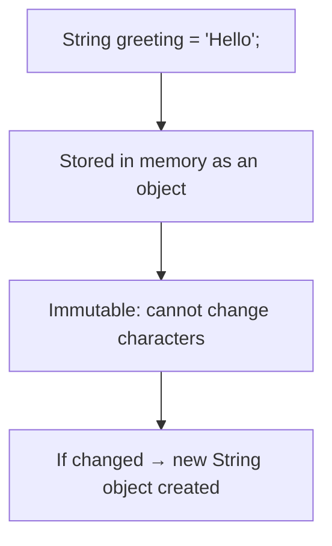

---

## 🧠 **Topic: Introduction to Java**

 

---

### 🔹 **1. What Is Java?**

**Java** is a **high-level, object-oriented programming language** developed by **Sun Microsystems** (now owned by **Oracle**) in **1995**.

It’s designed to be:

* **Simple** – easy to learn and read
* **Secure** – has built-in protection features
* **Portable** – runs on many platforms
* **Reliable** – great for large-scale systems

💬 **Tagline:**

> “Write Once, Run Anywhere.”

---

### 🔹 **2. How Java Works**

When you write a Java program:

1. **You write source code** → `HelloWorld.java`
2. **Java Compiler (javac)** converts it into **bytecode** → `HelloWorld.class`
3. **Java Virtual Machine (JVM)** executes that bytecode on any device.

🧩 **Flow:**

```
Source Code (.java)
        ↓
Bytecode (.class)
        ↓
Java Virtual Machine (JVM)
        ↓
Program Runs on Any OS
```

💡 This is why Java is **platform-independent** — it doesn’t depend on the operating system.

---

### 🔹 **3. Key Features of Java**

| Feature                     | Description                                     |
| --------------------------- | ----------------------------------------------- |
| ☕ **Simple**                | Easy syntax (similar to C++)                    |
| 🔁 **Object-Oriented**      | Based on objects and classes                    |
| 🌍 **Platform Independent** | Runs on any OS with JVM                         |
| 🧩 **Robust**               | Strong error handling and memory management     |
| 🔒 **Secure**               | No direct memory access (less prone to viruses) |
| ⚙️ **Multithreaded**        | Can perform multiple tasks at once              |
| ⚡ **High Performance**      | Uses bytecode for fast execution                |
| 🔄 **Distributed**          | Supports network-based applications             |
| 🧱 **Dynamic**              | Can adapt to evolving environments              |

---

### 🔹 **4. Components of Java**

Java has **three main components** that make up the Java platform:

| Component                          | Description                                                             |
| ---------------------------------- | ----------------------------------------------------------------------- |
| **JDK (Java Development Kit)**     | Tools for writing and compiling code (includes compiler, debugger, JVM) |
| **JRE (Java Runtime Environment)** | Allows you to run Java programs (includes JVM + libraries)              |
| **JVM (Java Virtual Machine)**     | Runs bytecode — the “engine” of Java                                    |

🧩 **Hierarchy:**

```
JDK
 ├── JRE
 │    └── JVM
```

---

### 🔹 **5. Structure of a Simple Java Program**

✅ Example:

```java
public class HelloWorld {
    public static void main(String[] args) {
        System.out.println("Hello, Java!");
    }
}
```

🖥️ **Output:**

```
Hello, Java!
```

---

### 🔹 **6. Explanation of the Code**

| Part                                     | Meaning                                                   |
| ---------------------------------------- | --------------------------------------------------------- |
| `public class HelloWorld`                | Defines a **class** (every Java program has at least one) |
| `public static void main(String[] args)` | Starting point (the JVM looks for this method first)      |
| `System.out.println("Hello, Java!");`    | Prints text to the screen                                 |
| `{ }`                                    | Encloses blocks of code                                   |
| `;`                                      | Ends a statement                                          |

---

### 🔹 **7. Java Program Execution Steps**

1. **Write** code in a `.java` file.
2. **Compile** using the `javac` command.

   ```
   javac HelloWorld.java
   ```
3. **Run** using the `java` command.

   ```
   java HelloWorld
   ```

🧠 Output appears in your terminal.

---

### 🔹 **8. Applications of Java**

Java is used in almost **every technology field** you can imagine:

| Area                   | Example                       |
| ---------------------- | ----------------------------- |
| 💻 Desktop Apps        | Eclipse, IntelliJ, NetBeans   |
| 🌐 Web Apps            | Spring, JSP, Servlets         |
| 📱 Mobile Apps         | Android Development           |
| ☁️ Cloud Computing     | AWS, Google Cloud             |
| 🧠 AI/ML Tools         | Weka, Deeplearning4j          |
| 🧾 Enterprise Software | Banking, ERP systems          |
| 🎮 Games               | Minecraft (built using Java!) |

---

### 🔹 **9. Advantages of Java**

✅ **Platform Independent** — runs anywhere with JVM
✅ **Object-Oriented** — promotes clean, modular code
✅ **Secure & Reliable** — less prone to crashes
✅ **Huge Community Support** — millions of developers
✅ **Rich API & Libraries** — ready-made tools for everything

---

### 🔹 **10. Disadvantages of Java**

⚠️ **Slightly slower** than low-level languages (like C++)
⚠️ **Verbose syntax** — sometimes longer to write
⚠️ **Needs JVM installed** to run programs

---

### 🔹 **11. History of Java (Quick Timeline)**

| Year      | Event                                          |
| --------- | ---------------------------------------------- |
| **1991**  | Started by James Gosling at Sun Microsystems   |
| **1995**  | Java officially released                       |
| **2009**  | Oracle acquired Sun Microsystems               |
| **Today** | Java continues to evolve (Java 21+ as of 2025) |

---

## ✨ **Good Practices in Java (Intro Level)**

| Practice                                          | Description                                             |
| ------------------------------------------------- | ------------------------------------------------------- |
| Always match **class name** with **file name**    | e.g., `HelloWorld.java` must contain `class HelloWorld` |
| Use **clear and descriptive class names**         | `StudentRecord`, not `Class1`                           |
| Include a **main method** for starting point      | `public static void main(String[] args)`                |
| Use **comments** for explanation                  | `// This prints a message`                              |
| Follow **indentation** and **naming conventions** | Improves readability                                    |
| Save files in the **same folder** when compiling  | Keeps project organized                                 |

---

## ☕ **Java Installation and Setup (JDK, JRE, IDE)**

 

---

### 🧩 **1. Key Components**

* **JDK (Java Development Kit)** → Used for writing & compiling Java programs (includes JRE + JVM).
* **JRE (Java Runtime Environment)** → Runs Java programs.
* **JVM (Java Virtual Machine)** → Executes Java bytecode on any system.

🧠 *Install the JDK — it already includes JRE and JVM.*

---

### ⚙️ **2. Installation Steps**

1. Download the latest JDK from:
   🔗 [https://www.oracle.com/java/technologies/downloads/](https://www.oracle.com/java/technologies/downloads/)
2. Install using the setup wizard.
3. Set the **Environment Variable PATH** to:

   ```
   C:\Program Files\Java\jdk-21\bin
   ```
4. Verify installation:

   ```
   java -version
   javac -version
   ```

---

### 💻 **3. Test Your Setup**

Create a file named `HelloWorld.java`:

```java
public class HelloWorld {
    public static void main(String[] args) {
        System.out.println("Hello, Java!");
    }
}
```

Then run:

```
javac HelloWorld.java
java HelloWorld
```

🖥️ Output: `Hello, Java!`

---

### 🧠 **4. IDE Options**

Use an **IDE** (Integrated Development Environment) for easier coding:

* **IntelliJ IDEA** (recommended)
* **Eclipse**
* **NetBeans**
* **VS Code** (with Java extensions)

---

### 🌟 **5. Good Practices**

✅ Install the latest **LTS version** (e.g., Java 21)
✅ Always use **JDK**, not JRE only
✅ Set the **PATH** correctly
✅ Match **class name** and **file name**
✅ Test with a **HelloWorld.java** file
✅ Keep **Java and IDE updated**

---

## 🧠 **Topic: Variables and Data Types in Java**

 

---

### 🔹 **1. What Is a Variable?**

A **variable** is like a **container** that stores data in your program.
Each variable has a **name**, a **type**, and a **value**.

💡 Example:

```java
int age = 18;
```

Here:

* `int` → data type
* `age` → variable name
* `18` → value stored in memory

---

### 🔹 **2. Rules for Naming Variables**

✅ Allowed:

* Must start with a **letter**, `_`, or `$`
* Can contain numbers (not at the start)
* Are **case-sensitive**

❌ Not allowed:

* No spaces
* No special characters like `@`, `#`, `%`
* Cannot use Java keywords (`class`, `int`, etc.)

✅ Examples:

```java
int studentAge;
double totalScore;
String userName;
```

❌ Invalid:

```java
int 1age;
int user-name;
int class;
```

---

### 🔹 **3. Types of Variables**

| Type                  | Description                                 | Example             |
| --------------------- | ------------------------------------------- | ------------------- |
| **Local Variable**    | Declared inside a method                    | `int x = 10;`       |
| **Instance Variable** | Declared inside a class but outside methods | `String name;`      |
| **Static Variable**   | Shared by all objects of a class            | `static int count;` |

---

### 🔹 **4. Data Types in Java**

Java is **strongly typed**, meaning every variable must have a **data type**.

---

### 🟢 **A. Primitive Data Types (8 types)**

| Type      | Size    | Example                 | Default Value |
| --------- | ------- | ----------------------- | ------------- |
| `byte`    | 1 byte  | `byte a = 10;`          | `0`           |
| `short`   | 2 bytes | `short s = 1000;`       | `0`           |
| `int`     | 4 bytes | `int age = 18;`         | `0`           |
| `long`    | 8 bytes | `long pop = 8000000L;`  | `0L`          |
| `float`   | 4 bytes | `float pi = 3.14f;`     | `0.0f`        |
| `double`  | 8 bytes | `double price = 99.99;` | `0.0d`        |
| `char`    | 2 bytes | `char grade = 'A';`     | `'\u0000'`    |
| `boolean` | 1 bit   | `boolean pass = true;`  | `false`       |

💡 **Tip:**
Use `float` for small decimals and `double` for high precision values.

---

### 🟣 **B. Non-Primitive Data Types**

These are **objects or references** — they store memory addresses instead of raw data.

| Type        | Example                      | Description                 |
| ----------- | ---------------------------- | --------------------------- |
| `String`    | `"Java"`                     | Sequence of characters      |
| `Array`     | `int[] nums = {1,2,3};`      | Collection of values        |
| `Class`     | `Student s = new Student();` | User-defined data structure |
| `Interface` | `Runnable r;`                | Blueprint for a class       |

---

### 🔹 **5. Example Program**

```java
public class VariablesExample {
    public static void main(String[] args) {
        int age = 17;
        double grade = 89.5;
        char section = 'A';
        boolean isStudent = true;
        String name = "Khiel";

        System.out.println("Name: " + name);
        System.out.println("Age: " + age);
        System.out.println("Grade: " + grade);
        System.out.println("Section: " + section);
        System.out.println("Enrolled: " + isStudent);
    }
}
```

🖥️ **Output:**

```
Name: Khiel
Age: 17
Grade: 89.5
Section: A
Enrolled: true
```

---

### 🔹 **6. Type Conversion**

* **Widening (Automatic):** smaller → larger
  Example: `int → double`

```java
int x = 10;
double y = x; // 10.0
```

* **Narrowing (Manual):** larger → smaller (needs casting)

```java
double a = 9.7;
int b = (int) a; // 9
```

---

## 🌟 **Good Practices for Variables and Data Types**

| Practice                          | Description                                   |
| --------------------------------- | --------------------------------------------- |
| ✅ Use **meaningful names**        | `studentAge` not `a1`                         |
| ✅ Choose the **right data type**  | Avoid using `int` for everything              |
| ✅ Initialize variables before use | Prevents errors                               |
| ✅ Use `final` for constants       | `final double PI = 3.1416;`                   |
| ✅ Use proper **case style**       | camelCase for variables (`totalScore`)        |
| ✅ Avoid magic numbers             | Use named constants instead                   |
| ✅ Keep scope small                | Declare variables close to where you use them |

---

### 🧾 **Summary**

* **Variables** store data values.
* **Data types** define what kind of data a variable can hold.
* **Primitive types** are basic built-in types (int, double, char, etc.).
* **Non-primitive types** include `String`, `Array`, and custom classes.
* Always choose the **right type**, use **clear names**, and **initialize variables** before using them.

---

## 🧠 **Topic: Constants and Literals in Java**

 

---

### 🔹 **1. What Are Constants?**

A **constant** is a variable whose value **cannot be changed** after it’s assigned.

You declare a constant using the **`final` keyword**.

✅ **Example:**

```java
final double PI = 3.1416;
```

Once declared, you can’t modify it:

```java
PI = 3.15; // ❌ Error! Cannot assign a value to final variable
```

---

### 🔹 **2. Why Use Constants?**

✅ Improves **readability**
✅ Prevents **accidental changes**
✅ Makes code **easier to maintain**

💡 Example:

```java
final int MAX_STUDENTS = 50;

if (students > MAX_STUDENTS) {
    System.out.println("Class is full!");
}
```

Instead of hardcoding `50`, we use a constant — more descriptive and easier to update later.

---

### 🔹 **3. Naming Convention for Constants**

By convention:

* Constants use **UPPERCASE letters**
* Words are separated by underscores `_`

✅ Examples:

```java
final int MAX_SPEED = 120;
final double SALES_TAX = 0.12;
final String SCHOOL_NAME = "Tech High";
```

---

### 🔹 **4. What Are Literals?**

A **literal** is a **fixed value** that you assign to a variable or constant.
It represents the actual data in your code.

Example:

```java
int age = 18;        // 18 → integer literal
double price = 9.99; // 9.99 → double literal
char grade = 'A';    // 'A' → character literal
boolean pass = true; // true → boolean literal
String name = "Khiel"; // "Khiel" → string literal
```

---

### 🔹 **5. Types of Literals**

| Type               | Example                 | Description                                 |
| ------------------ | ----------------------- | ------------------------------------------- |
| **Integer**        | `int x = 10;`           | Whole numbers (can be decimal, hex, binary) |
| **Floating-point** | `float f = 3.14f;`      | Decimal numbers                             |
| **Character**      | `char c = 'A';`         | Single characters inside single quotes      |
| **String**         | `String name = "Java";` | Sequence of characters inside double quotes |
| **Boolean**        | `boolean done = false;` | True or false values                        |
| **Null**           | `String name = null;`   | Represents no value (only for objects)      |

---

### 🔹 **6. Numeric Literal Examples**

#### 🔸 Integer Literals

```java
int dec = 25;       // Decimal
int bin = 0b11001;  // Binary (prefix 0b)
int oct = 031;      // Octal (prefix 0)
int hex = 0x19;     // Hexadecimal (prefix 0x)
```

#### 🔸 Floating-Point Literals

```java
float pi = 3.14f;
double g = 9.81;
```

💡 Always add `f` or `F` for floats.

---

### 🔹 **7. Character and String Literals**

```java
char letter = 'J';
String word = "Java";
```

You can also use **escape sequences** in strings:

| Escape | Meaning  | Example            | Output           |
| ------ | -------- | ------------------ | ---------------- |
| `\n`   | New line | `"Hello\nWorld"`   | Hello <br> World |
| `\t`   | Tab      | `"A\tB"`           | A B              |
| `\"`   | Quote    | `"He said \"Hi\""` | He said "Hi"     |

---

### 🔹 **8. Boolean and Null Literals**

```java
boolean isPassed = true;
boolean isDone = false;
String name = null; // no value assigned yet
```

---

### 🔹 **9. Example Program**

```java
public class ConstantsAndLiterals {
    public static void main(String[] args) {
        final double PI = 3.1416;
        int radius = 5;
        double area = PI * radius * radius;

        System.out.println("Radius: " + radius);
        System.out.println("Area: " + area);
    }
}
```

🖥️ **Output:**

```
Radius: 5
Area: 78.54
```

---

## 🌟 **Good Practices for Constants and Literals**

| Practice                                      | Description                          |
| --------------------------------------------- | ------------------------------------ |
| ✅ Use `final` for values that must not change | Prevents accidental modification     |
| ✅ Write constants in **ALL_CAPS**             | e.g. `final int MAX_SPEED = 120;`    |
| ✅ Use **meaningful names**                    | Avoid `X`, `Y`; use `MAX_AGE`, `PI`  |
| ✅ Don’t hardcode “magic numbers”              | Use constants instead of raw numbers |
| ✅ Always use correct suffix (`f`, `L`)        | `3.14f` for float, `5000L` for long  |
| ✅ Group constants logically                   | Place them at the top of the class   |
| ✅ Use `null` carefully                        | Avoid if you can — check before use  |

---

### 🧾 **Summary**

* **Constants** are variables whose values **cannot change** (`final`).
* **Literals** are the **actual values** you assign to variables (like `10`, `'A'`, `"Java"`, `true`).
* Use **UPPERCASE names** for constants and **clear, meaningful names** for variables.
* Always **avoid magic numbers** — replace them with constants.
* **final + descriptive name = clean, professional Java code.**

---

## 🧠 **Topic: Input and Output (Scanner Class)**

 

---

### 🔹 **1. What Is Input and Output?**

* **Input** → data given *to* the program (like user typing in a name or number)
* **Output** → data sent *from* the program (like messages displayed on the screen)

💬 Example:

> Program asks: “Enter your name:”
> User types: `Khiel`
> Program outputs: “Hello, Khiel!”

---

### 🔹 **2. Importing the Scanner Class**

To get input from the keyboard, we use **`Scanner`**, a built-in class in Java.

✅ **Syntax:**

```java
import java.util.Scanner;
```

You must import it at the **top** of your program (before the `class` declaration).

---

### 🔹 **3. Creating a Scanner Object**

✅ Example:

```java
Scanner input = new Scanner(System.in);
```

* `Scanner` → the class name
* `input` → the object name (you can name it anything)
* `System.in` → means "keyboard input"

---

### 🔹 **4. Reading Different Types of Input**

| Method          | Description                     | Example                               |
| --------------- | ------------------------------- | ------------------------------------- |
| `nextLine()`    | Reads a full line (with spaces) | `String name = input.nextLine();`     |
| `next()`        | Reads one word (until space)    | `String word = input.next();`         |
| `nextInt()`     | Reads an integer                | `int age = input.nextInt();`          |
| `nextDouble()`  | Reads a decimal                 | `double price = input.nextDouble();`  |
| `nextBoolean()` | Reads true/false                | `boolean pass = input.nextBoolean();` |
| `nextFloat()`   | Reads a float number            | `float score = input.nextFloat();`    |
| `nextLong()`    | Reads a long integer            | `long bigNum = input.nextLong();`     |

---

### 🔹 **5. Example Program (Basic Input)**

```java
import java.util.Scanner;

public class UserInfo {
    public static void main(String[] args) {
        Scanner input = new Scanner(System.in);

        System.out.print("Enter your name: ");
        String name = input.nextLine();

        System.out.print("Enter your age: ");
        int age = input.nextInt();

        System.out.println("Hello, " + name + "! You are " + age + " years old.");

        input.close(); // always close scanner
    }
}
```

🖥️ **Output:**

```
Enter your name: Khiel
Enter your age: 17
Hello, Khiel! You are 17 years old.
```

---

### 🔹 **6. Taking Multiple Inputs**

```java
System.out.print("Enter two numbers: ");
int a = input.nextInt();
int b = input.nextInt();
System.out.println("Sum: " + (a + b));
```

🖥️ **Output:**

```
Enter two numbers: 10 5
Sum: 15
```

---

### 🔹 **7. Important: Mixing nextLine() with nextInt()**

When you use both `nextInt()` and `nextLine()` together, be careful — `nextInt()` doesn’t read the **Enter key**.
So you need to consume it manually:

✅ Example:

```java
System.out.print("Enter your age: ");
int age = input.nextInt();
input.nextLine(); // consume leftover newline

System.out.print("Enter your name: ");
String name = input.nextLine();

System.out.println("Hi, " + name + "! You are " + age + " years old.");
```

---

### 🔹 **8. Output in Java**

Output is displayed using `System.out`:

| Method                 | Description                     | Example                                |
| ---------------------- | ------------------------------- | -------------------------------------- |
| `System.out.print()`   | Prints text (no new line)       | `System.out.print("Hello");`           |
| `System.out.println()` | Prints text + moves to new line | `System.out.println("Hello");`         |
| `System.out.printf()`  | Formatted output (like C)       | `System.out.printf("Age: %d%n", age);` |

✅ Example:

```java
System.out.print("Name: ");
System.out.println("Khiel");
System.out.printf("Age: %d%n", 17);
```

🖥️ **Output:**

```
Name: Khiel
Age: 17
```

---

### 🔹 **9. Using printf() for Formatted Output**

You can format numbers and text neatly.

| Format | Description    | Example                              | Output      |
| ------ | -------------- | ------------------------------------ | ----------- |
| `%d`   | Integer        | `System.out.printf("%d", 25);`       | `25`        |
| `%f`   | Decimal number | `System.out.printf("%.2f", 3.1416);` | `3.14`      |
| `%s`   | String         | `System.out.printf("%s", "Java");`   | `Java`      |
| `%n`   | New line       | `System.out.printf("Hi%nBye");`      | Hi <br> Bye |

✅ Example:

```java
double price = 99.5;
System.out.printf("Price: ₱%.2f%n", price);
```

🖥️ Output:

```
Price: ₱99.50
```

---

### 🔹 **10. Closing the Scanner**

Always close your `Scanner` object after use to free up system resources.

✅ Example:

```java
input.close();
```

---

## 🌟 **Good Practices for Input and Output**

| Practice                                         | Description                              |
| ------------------------------------------------ | ---------------------------------------- |
| ✅ Always `import java.util.Scanner`              | Needed for keyboard input                |
| ✅ Use **meaningful variable names**              | e.g., `Scanner userInput`                |
| ✅ Close the `Scanner` after use                  | `input.close();`                         |
| ✅ Be careful mixing `nextInt()` and `nextLine()` | Consume newline using `input.nextLine()` |
| ✅ Use `printf()` for clean, formatted output     | Easier to align text or decimals         |
| ✅ Prompt clearly before input                    | Always tell users what to enter          |
| ✅ Handle invalid inputs carefully                | Use `try-catch` for safety (advanced)    |

---

### 🧾 **Summary**

* **Input** = data entered by the user (`Scanner class`).
* **Output** = data shown to the user (`System.out.print`, `println`, `printf`).
* Use **`nextInt()`, `nextDouble()`, `nextLine()`** to read different types.
* Always **import Scanner**, **prompt clearly**, and **close it** after use.
* `printf()` gives you clean and formatted results.

---

## 🧠 **Topic: Operators in Java**

*(Arithmetic, Relational, Logical, Assignment)*

 

---

### 🔹 **1. What Are Operators?**

Operators are **symbols** that perform actions on variables and values.

Example:

```java
int sum = 10 + 5;
```

Here:

* `+` → operator
* `10` and `5` → operands
* `sum` → variable storing the result

---

## 🧩 **A. Arithmetic Operators**

Used to perform **basic mathematical operations**.

| Operator | Description         | Example  | Output |
| -------- | ------------------- | -------- | ------ |
| `+`      | Addition            | `10 + 5` | `15`   |
| `-`      | Subtraction         | `10 - 5` | `5`    |
| `*`      | Multiplication      | `10 * 5` | `50`   |
| `/`      | Division            | `10 / 5` | `2`    |
| `%`      | Modulus (remainder) | `10 % 3` | `1`    |

✅ **Example Program:**

```java
int a = 10, b = 3;
System.out.println("Sum = " + (a + b));
System.out.println("Difference = " + (a - b));
System.out.println("Product = " + (a * b));
System.out.println("Quotient = " + (a / b));
System.out.println("Remainder = " + (a % b));
```

🖥️ Output:

```
Sum = 13
Difference = 7
Product = 30
Quotient = 3
Remainder = 1
```

💡 Note: When dividing integers, the result is **also an integer** (decimal part is removed).

---

### 🔹 **Increment & Decrement Operators**

| Operator | Description          | Example        | Effect      |
| -------- | -------------------- | -------------- | ----------- |
| `++`     | Increases value by 1 | `x++` or `++x` | `x = x + 1` |
| `--`     | Decreases value by 1 | `x--` or `--x` | `x = x - 1` |

✅ Example:

```java
int x = 5;
x++; // becomes 6
++x; // becomes 7
System.out.println(x); // 7
```

---

## 🧩 **B. Relational (Comparison) Operators**

Used to **compare** two values.
The result is always **true** or **false** (boolean).

| Operator | Description      | Example  | Result  |
| -------- | ---------------- | -------- | ------- |
| `==`     | Equal to         | `5 == 5` | `true`  |
| `!=`     | Not equal to     | `5 != 3` | `true`  |
| `>`      | Greater than     | `8 > 5`  | `true`  |
| `<`      | Less than        | `3 < 5`  | `true`  |
| `>=`     | Greater or equal | `5 >= 5` | `true`  |
| `<=`     | Less or equal    | `4 <= 3` | `false` |

✅ Example:

```java
int a = 10, b = 20;
System.out.println(a > b);  // false
System.out.println(a < b);  // true
System.out.println(a == b); // false
System.out.println(a != b); // true
```

---

## 🧩 **C. Logical Operators**

Used to **combine multiple conditions**.

| Operator | Meaning | Example             | Result                 |         |   |          |                              |
| -------- | ------- | ------------------- | ---------------------- | ------- | - | -------- | ---------------------------- |
| `&&`     | AND     | `(a > 5 && b < 10)` | true only if both true |         |   |          |                              |
| `        |         | `                   | OR                     | `(a > 5 |   | b < 10)` | true if at least one is true |
| `!`      | NOT     | `!(a > 5)`          | reverses the result    |         |   |          |                              |

✅ Example:

```java
int age = 18;
boolean hasID = true;

if (age >= 18 && hasID) {
    System.out.println("You may enter.");
} else {
    System.out.println("Access denied.");
}
```

🖥️ Output:

```
You may enter.
```

✅ Example with OR:

```java
int num = 5;
if (num == 0 || num % 2 == 0) {
    System.out.println("Even or zero");
} else {
    System.out.println("Odd");
}
```

🖥️ Output:

```
Odd
```

✅ Example with NOT:

```java
boolean isRainy = false;
System.out.println(!isRainy); // true
```

---

## 🧩 **D. Assignment Operators**

Used to **assign values** to variables.

| Operator | Description       | Example  | Equivalent To |
| -------- | ----------------- | -------- | ------------- |
| `=`      | Assign value      | `x = 10` | —             |
| `+=`     | Add & assign      | `x += 5` | `x = x + 5`   |
| `-=`     | Subtract & assign | `x -= 3` | `x = x - 3`   |
| `*=`     | Multiply & assign | `x *= 2` | `x = x * 2`   |
| `/=`     | Divide & assign   | `x /= 4` | `x = x / 4`   |
| `%=`     | Modulus & assign  | `x %= 2` | `x = x % 2`   |

✅ Example:

```java
int x = 10;
x += 5;  // x = 15
x *= 2;  // x = 30
System.out.println(x); // 30
```

---

## 🌟 **Good Practices for Operators**

| Practice                                       | Description                                                        |
| ---------------------------------------------- | ------------------------------------------------------------------ |
| ✅ Use parentheses `( )` for clarity            | `result = (a + b) * c;`                                            |
| ✅ Be careful with integer division             | `5 / 2` = `2`, not `2.5`                                           |
| ✅ Use correct comparison (`==`) for primitives | Don’t confuse with assignment `=`                                  |
| ✅ Combine logical operators clearly            | e.g. `(age >= 18 && hasID)`                                        |
| ✅ Use meaningful variable names                | Makes conditions easier to read                                    |
| ✅ Avoid overly complex conditions              | Split into multiple `if` statements if needed                      |
| ✅ Remember operator precedence                 | Multiplication and division happen before addition and subtraction |

---

### 🧾 **Summary**

* **Arithmetic operators**: Perform math (`+`, `-`, `*`, `/`, `%`)
* **Relational operators**: Compare values (`==`, `!=`, `>`, `<`, `>=`, `<=`)
* **Logical operators**: Combine conditions (`&&`, `||`, `!`)
* **Assignment operators**: Store and update values (`=`, `+=`, `-=`, etc.)
* Always use **parentheses**, **clear variable names**, and **test your conditions carefully**.

---

## 🧠 **Topic: Type Casting in Java**

 

---

### 🔹 **1. What Is Type Casting?**

**Type casting** means **changing a variable from one data type to another.**

💡 Example:

```java
double pi = 3.14;
int value = (int) pi;  // type casting from double → int
```

🧩 Output:

```
3
```

---

### 🔹 **2. Two Types of Casting in Java**

| Type                     | Description                      | Conversion Direction  |
| ------------------------ | -------------------------------- | --------------------- |
| **Widening (Implicit)**  | Done **automatically** by Java   | smaller → larger type |
| **Narrowing (Explicit)** | Done **manually** using `(type)` | larger → smaller type |

---

## 🟢 **A. Widening Type Casting (Automatic Conversion)**

* Happens **automatically**
* **No data loss**
* Safe conversion

💡 **Example:**

```java
int num = 10;
double result = num; // int → double
System.out.println(result);
```

🖥️ **Output:**

```
10.0
```

✅ Java automatically converted `int` to `double`.

**Possible widening conversions:**

```
byte → short → int → long → float → double
```

---

## 🔵 **B. Narrowing Type Casting (Manual Conversion)**

* Done **manually** using `(type)`
* May cause **data loss**

💡 **Example:**

```java
double pi = 3.1416;
int value = (int) pi;  // manual casting
System.out.println(value);
```

🖥️ **Output:**

```
3
```

⚠️ Decimal part is lost.

**Possible narrowing conversions:**

```
double → float → long → int → short → byte
```

---

### 🔹 **3. Type Casting Between Numbers**

✅ **Example:**

```java
float f = 9.75f;
int i = (int) f;
System.out.println(i);
```

🖥️ Output:

```
9
```

---

### 🔹 **4. Casting and Arithmetic**

Java automatically promotes smaller types to larger ones during math operations.

✅ Example:

```java
int a = 5;
double b = 2;
double result = a / b; // a is promoted to double
System.out.println(result);
```

🖥️ Output:

```
2.5
```

---

### 🔹 **5. Casting with Characters**

Characters (`char`) are stored as numeric Unicode values, so you can cast them to or from numbers.

✅ Example:

```java
char letter = 'A';
int code = (int) letter; // convert char → int
System.out.println(code);
```

🖥️ Output:

```
65
```

✅ Example 2:

```java
int num = 66;
char ch = (char) num; // int → char
System.out.println(ch);
```

🖥️ Output:

```
B
```

---

### 🔹 **6. Type Casting and Scanner Input**

All data from `Scanner` is **read as strings**, so you must cast or convert to other types if needed.

✅ Example:

```java
import java.util.Scanner;

public class InputExample {
    public static void main(String[] args) {
        Scanner input = new Scanner(System.in);

        System.out.print("Enter a number: ");
        String str = input.nextLine();

        int num = Integer.parseInt(str); // String → int
        System.out.println("You entered: " + num);

        input.close();
    }
}
```

🖥️ Output:

```
Enter a number: 25
You entered: 25
```

---

### 🔹 **7. Converting Between Data Types**

| From              | To                           | Method |
| ----------------- | ---------------------------- | ------ |
| `String → int`    | `Integer.parseInt("10")`     |        |
| `String → double` | `Double.parseDouble("10.5")` |        |
| `int → String`    | `String.valueOf(10)`         |        |
| `double → String` | `String.valueOf(10.5)`       |        |
| `char → int`      | `(int) 'A'`                  |        |
| `int → char`      | `(char) 65`                  |        |

---

### 🔹 **8. Common Mistakes**

❌ Forgetting to cast when narrowing:

```java
int x = 10.5; // Error! double → int not automatic
```

✅ Fix:

```java
int x = (int) 10.5;
```

❌ Data loss when narrowing:

```java
int big = 130;
byte b = (byte) big; // Overflow! value wraps around
System.out.println(b); // Output: -126
```

💡 Use narrowing carefully!

---

## 🌟 **Good Practices for Type Casting**

| Practice                                       | Description                                   |
| ---------------------------------------------- | --------------------------------------------- |
| ✅ Prefer **widening** (automatic)              | It’s safe and doesn’t lose data               |
| ✅ Be careful with **narrowing**                | Might cause data loss or overflow             |
| ✅ Always use `(type)` when converting manually | e.g., `(int)`, `(double)`                     |
| ✅ Convert **strings using wrapper classes**    | `Integer.parseInt()`, `Double.parseDouble()`  |
| ✅ Test edge cases                              | e.g., when casting very large numbers         |
| ✅ Add comments to explain conversions          | Helps others understand why casting is needed |

---

### 🧾 **Summary**

* **Type casting** converts one data type into another.
* **Widening** (small → large) happens automatically.
* **Narrowing** (large → small) must be done manually using `(type)`.
* Be careful with **data loss** in narrowing conversions.
* Use **wrapper classes** for converting between `String` and numbers.
* Always test and document conversions clearly.

---

## 🧠 **Topic: If–Else Statements in Java**

 

---

### 🔹 **1. What Are If–Else Statements?**

The **`if–else` statement** allows your program to **execute certain code only when a condition is true**, and optionally do something else if it’s false.

💡 It’s how Java makes **decisions**.

✅ **Basic Syntax:**

```java
if (condition) {
    // code runs if condition is true
} else {
    // code runs if condition is false
}
```

---

### 🔹 **2. How It Works**

1. The condition inside `()` is **checked**.
2. If it’s **true** → run the code inside `if`.
3. If it’s **false** → skip `if` and run the `else` part (if present).

---

### 🔹 **3. Example 1: Simple If–Else**

```java
int age = 18;

if (age >= 18) {
    System.out.println("You can vote!");
} else {
    System.out.println("You are too young to vote.");
}
```

🖥️ **Output:**

```
You can vote!
```

---

### 🔹 **4. Example 2: Only If (No Else)**

```java
int number = 10;

if (number > 0) {
    System.out.println("Positive number");
}
```

🖥️ **Output:**

```
Positive number
```

(No `else` — program does nothing if condition is false.)

---

### 🔹 **5. Example 3: If–Else with Relational Operators**

```java
int grade = 75;

if (grade >= 75) {
    System.out.println("You passed!");
} else {
    System.out.println("You failed.");
}
```

🖥️ **Output:**

```
You passed!
```

---

### 🔹 **6. Example 4: If–Else with Logical Operators**

You can combine multiple conditions using `&&`, `||`, `!`.

```java
int age = 20;
boolean hasID = true;

if (age >= 18 && hasID) {
    System.out.println("Entry allowed.");
} else {
    System.out.println("Access denied.");
}
```

🖥️ **Output:**

```
Entry allowed.
```

---

### 🔹 **7. Example 5: Multiple If–Else**

Use multiple conditions in sequence.

```java
int score = 85;

if (score >= 90) {
    System.out.println("Grade A");
} else if (score >= 80) {
    System.out.println("Grade B");
} else if (score >= 70) {
    System.out.println("Grade C");
} else {
    System.out.println("Grade F");
}
```

🖥️ **Output:**

```
Grade B
```

---

### 🔹 **8. Example 6: If–Else with Strings**

When comparing strings, use `.equals()` (not `==`).

```java
String color = "red";

if (color.equals("red")) {
    System.out.println("Stop!");
} else {
    System.out.println("Go!");
}
```

🖥️ **Output:**

```
Stop!
```

💡 `==` compares *memory addresses*, while `.equals()` compares *actual text*.

---

### 🔹 **9. Example 7: Nested If**

An `if` statement inside another `if`.

```java
int age = 20;
boolean hasLicense = true;

if (age >= 18) {
    if (hasLicense) {
        System.out.println("You can drive!");
    } else {
        System.out.println("Get a license first.");
    }
} else {
    System.out.println("You are too young to drive.");
}
```

🖥️ **Output:**

```
You can drive!
```

---

### 🔹 **10. Example 8: Short Form (Ternary Operator)**

For quick, one-line decisions:

```java
int number = 5;
String result = (number % 2 == 0) ? "Even" : "Odd";
System.out.println(result);
```

🖥️ **Output:**

```
Odd
```

📘 **Syntax:**

```java
(condition) ? valueIfTrue : valueIfFalse;
```

---

## 🌟 **Good Practices for If–Else Statements**

| Practice                                               | Description                                          |
| ------------------------------------------------------ | ---------------------------------------------------- |
| ✅ Always use **clear conditions**                      | Example: `if (age >= 18)`                            |
| ✅ Use **curly braces `{}`** even for one-line blocks   | Prevents logic errors                                |
| ✅ Use **indentation** for readability                  | Makes nested logic clear                             |
| ✅ Use **`else if`** for multiple choices               | Avoids too many nested ifs                           |
| ✅ Use **`.equals()`** for strings                      | `==` is for primitive types only                     |
| ✅ Keep conditions **simple**                           | Split complex ones into smaller ifs                  |
| ✅ Test **boundary values**                             | Example: if passing score is 75, test 74, 75, and 76 |
| ✅ Use **ternary operator** for short, simple decisions | Example: `isEven ? "Even" : "Odd"`                   |

---

### 🧾 **Summary**

* `if` checks a **condition** — runs code if it’s **true**.
* `else` runs when the condition is **false**.
* `else if` allows **multiple conditions**.
* Use `.equals()` for **string comparison**.
* `? :` (ternary) is a short form for simple conditions.
* Always use **clear**, **readable**, and **properly indented** code.

---

## 🧠 Nested If–Else

 

---

1. **Definition**
   A **nested if–else** is an `if` or `if–else` statement placed *inside* another `if` or `else` block. It lets you make multi-level, dependent decisions: the inner (`nested`) condition is evaluated only when the outer condition is true (or in the branch where it lives).

---

2. **Purpose / Importance**

* **Handle dependent checks:** Use nested if–else when the second decision depends on the first (e.g., “if user is logged in → then check role”).
* **Model multi-step logic:** It represents decision trees where each branch needs further checks.
* **Readability & correctness:** When used carefully it maps real-world multi-step rules into code clearly. Misused, it can become hard to read, so structure and comments matter.

---

3. **Syntax / Structure**

```java
if (outerCondition) {
    // outer-true block
    if (innerCondition) {
        // inner-true block
    } else {
        // inner-false block
    }
} else {
    // outer-false block
}
```

You can nest Arbitrary levels, but prefer 2–3 levels for readability. Always use braces `{}` for each block.

---

4. **Example Code with Explanation**

Working example: a program that checks whether a student is eligible for a scholarship. Eligibility rules:

* Student must have `grade >= 85` to be considered.
* If considered, then:

  * If `attendance >= 95` → **Full scholarship**.
  * Else if `attendance >= 90` → **Partial scholarship**.
  * Else → **No scholarship**.
* If `grade < 85` → **Not eligible**.

```java
public class ScholarshipChecker {
    public static void main(String[] args) {
        int grade = 88;           // student's grade (0-100)
        int attendance = 92;      // attendance percent (0-100)

        if (grade >= 85) {                       // outer if: is student considered?
            // student is considered — now check attendance (nested)
            if (attendance >= 95) {
                System.out.println("Full scholarship");
            } else if (attendance >= 90) {
                System.out.println("Partial scholarship");
            } else {
                System.out.println("No scholarship");
            }
        } else {
            // outer else: grade too low
            System.out.println("Not eligible for scholarship");
        }
    }
}
```

Line-by-line explanation:

* `int grade = 88;` — set sample grade.
* `int attendance = 92;` — set sample attendance.
* `if (grade >= 85)` — outer check: only students with grade 85+ are considered. If false, we skip all attendance checks.
* Inside the outer `if`:

  * `if (attendance >= 95)` — first nested check for the best case (full scholarship).
  * `else if (attendance >= 90)` — second nested check (partial scholarship).
  * `else` — fallback inside nested block: no scholarship despite being considered.
* `else` after the outer `if` executes when `grade < 85`, printing "Not eligible...".

With `grade = 88` and `attendance = 92`, program prints: `Partial scholarship`.

---

5. **Common Mistakes or Tips**

* **Missing braces `{}`:** Omitting braces causes logic errors when you add statements later. Always use braces for clarity.

  ```java
  if (a > b)
      if (c > d)
          doSomething();
      else
          doSomethingElse(); // this else belongs to inner if — might be surprising
  ```
* **Deep nesting reduces readability:** If you find yourself nesting >3 levels, refactor into methods or use `else if` chains or switch (where appropriate).
* **Use `else if` when checks are at the same level:** If conditions are independent alternatives (mutually exclusive), prefer `else if` rather than nested `if` inside an `if`’s true branch.
* **String comparisons:** When nested checks involve strings, use `.equals()` or `.equalsIgnoreCase()` — not `==`.

  ```java
  if (role.equals("admin")) { ... }  // correct
  ```
* **Short-circuit logic vs nesting:** Sometimes `&&`/`||` combine checks more clearly than nesting. Example:

  ```java
  if (grade >= 85 && attendance >= 95) {
      // full scholarship — no nested if needed
  }
  ```
* **Validate inputs first:** If user input can be invalid (negative grade, out-of-range attendance), validate before nested logic to avoid incorrect decisions.
* **Comment the purpose** of each nested branch — it helps future you and others.

---

6. **Mini Practice Task**
   Create a console program that:

* Reads three integers from the user: `age`, `hasPermit` (0 or 1), and `visionScore` (0–100).
* Rules:

  * If `age < 16` → print `"Too young to apply"`.
  * Else (age >= 16):

    * If `hasPermit == 1`:

      * If `visionScore >= 80` → `"Eligible for driving test"`.
      * Else → `"Vision too low for test"`.
    * Else (no permit):

      * If `visionScore >= 90` → `"Apply for permit first"`.
      * Else → `"Get vision checked and apply for permit"`.

Implement this using nested `if–else` and test with different inputs (e.g., age 15, age 17 with/without permit, low/high vision scores).

---

# Switch Statement — Clear, Detailed, Beginner-Friendly

---

# Switch Statement — Clear, Detailed, Beginner-Friendly (for your `README.md`)

> **Written like ChatGPT-5:** concise, clear, and friendly — ready to paste into a `.md` file on GitHub.
> Includes examples, a flowchart, tips, and a mini exercise.

---

 

---

## 1. Definition

A **`switch` statement** in Java is a control-flow structure that **selects and executes one block of code** among many, based on the value of a single expression (the *switch expression*). It’s a clearer and often cleaner alternative to long `if–else if` chains when you compare one value against multiple constant options.

---

## 2. Purpose / Importance

* **Readability:** Replaces long `if–else if` ladders with a tidy structure.
* **Clarity:** Each case is explicit and grouped.
* **Performance:** For some use cases, the JVM can optimize `switch` better than repeated `if` checks.
* **Use cases:** Menu selection, mapping discrete values to actions, interpreting enums, handling small sets of commands, or routing based on simple key values.

---

## 3. Syntax / Structure

### Classic `switch` (Java 7+ supports `String` too)

```java
switch (expression) {
    case constant1:
        // statements
        break;
    case constant2:
        // statements
        break;
    // ...
    default:
        // statements when no case matches
}
```

* `expression` → value to compare (int, byte, short, char, String, enum, and a few boxed types).
* Each `case` must be a compile-time constant.
* `break` prevents *fall-through* (execution continuing into the next case).
* `default` runs when no `case` matches (optional but recommended).

### Modern (Java 14+) switch expression (works as expression or with arrow labels)

```java
String result = switch (day) {
    case "MONDAY", "FRIDAY" -> "Start/End week";
    case "SATURDAY", "SUNDAY" -> "Weekend";
    default -> "Midweek";
};
```

* Arrow `->` style avoids fall-through and is concise.
* You can return values directly from the `switch`.

---

## 4. Example Code with Explanation

### Example: Simple Menu using classic `switch`

```java
import java.util.Scanner;

public class MenuExample {
    public static void main(String[] args) {
        Scanner sc = new Scanner(System.in);
        System.out.println("Choose an option: 1) Add  2) Subtract  3) Exit");
        System.out.print("Enter choice: ");
        int choice = sc.nextInt();

        switch (choice) {
            case 1:
                System.out.println("You chose Add.");
                break;
            case 2:
                System.out.println("You chose Subtract.");
                break;
            case 3:
                System.out.println("Exiting program...");
                break;
            default:
                System.out.println("Invalid choice. Please enter 1, 2, or 3.");
        }

        sc.close();
    }
}
```

#### Line-by-line explanation

1. `Scanner sc = new Scanner(System.in);` — create Scanner for user input.
2. Prompt the user with menu text.
3. `int choice = sc.nextInt();` — read the user's numeric choice.
4. `switch (choice) {` — start switch on the integer `choice`.
5. `case 1:` — if `choice` equals `1`, execute the next statements.
6. `System.out.println("You chose Add.");` — prints the response for case 1.
7. `break;` — stops execution of the switch after this case (prevents fall-through).
8. `case 2:` and `case 3:` — other choices handled similarly.
9. `default:` — runs when `choice` doesn’t match any case. Good for validation/error message.
10. `sc.close();` — close the Scanner to free resources.

**Behavior notes:**

* With `choice = 1`, output: `You chose Add.`
* If `break` is omitted after `case 1`, execution would "fall through" and also run `case 2` statements (often a bug unless intentional).

---

### Example: Java 14+ Arrow-style `switch` (returns value)

```java
String day = "SATURDAY";

String type = switch (day) {
    case "MONDAY", "FRIDAY" -> "Week boundary";
    case "SATURDAY", "SUNDAY" -> "Weekend";
    case "TUESDAY", "WEDNESDAY", "THURSDAY" -> "Midweek";
    default -> "Unknown day";
};

System.out.println(day + " is a " + type);
```

* This is concise, avoids `break`, and can return a value directly.

---

## 5. Common Mistakes or Tips

### ✅ Tips (best practices)

* **Always include `default`** to handle unexpected values.
* Use `break` in classic `switch` unless you *explicitly* want fall-through.
* Prefer **arrow-style** `switch` (Java 14+) for readability and safety.
* Use **enums** with `switch` when possible — they are readable and safe.
* When matching Strings, switch is more readable than many `if (s.equals(...))`.

### ⚠️ Common mistakes

* **Forgetting `break`** — causes fall-through bugs.
* **Using non-constant expressions in `case`** — `case` must be a compile-time constant.
* **Relying on `==` for String equality** (if using `if` chains) — but `switch` on `String` uses .equals under the hood.
* **Switching on floating point types** — you can’t use `float` or `double` in switch. Use integers, enums, or strings.

### ⚠️ Fall-through example (buggy if unintended)

```java
switch (n) {
    case 1:
        System.out.println("One");
    case 2:
        System.out.println("Two"); // runs when n == 1 unless break after case 1
        break;
}
```

---

## 6. Mini Practice Task

**Task:** Create a program `GradeDescription.java` that:

* Reads a single character grade from the user (`A`, `B`, `C`, `D`, `F`).
* Uses a `switch` to print:

  * `A` → `"Excellent"`
  * `B` → `"Good"`
  * `C` → `"Fair"`
  * `D` → `"Poor"`
  * `F` → `"Fail"`
  * default → `"Invalid grade"`
* Accept both lowercase and uppercase input (hint: convert input to uppercase before switching).

**Stretch:** Implement the same logic using the arrow-style `switch` and return the description to print.

---

## Extra: Visual Flow (Mermaid) — paste this to GitHub to render

```mermaid
flowchart TD
  Start([Start]) --> Input[/"Read value (expression)"/]
  Input --> Switch{switch(expression)}
  Switch --> |case A| CaseA[/"run statements for A"/]
  Switch --> |case B| CaseB[/"run statements for B"/]
  Switch --> |case C| CaseC[/"run statements for C"/]
  Switch --> |no match| Default[/"run default"/]
  CaseA --> End([End])
  CaseB --> End
  CaseC --> End
  Default --> End
```

---

## Short Cheat-Summary (one paragraph)

A `switch` chooses one path among many based on a single value. Use `switch` to simplify multiple equality checks (ints, strings, enums). In the classic form, protect each case with `break` or intentionally allow fall-through; in modern Java use arrow `->` switch expressions to return values and avoid fall-through. Always include `default` to handle unexpected input.

---

If you want, I can:

* Convert this to a ready-to-paste `.md` file with nicer badges and a small SVG header, or
* Provide the full solution for the **Mini Practice Task** in both classic and arrow-style `switch`. Which would you like?
# Switch Statement — Clear, Detailed, Beginner-Friendly (for your `README.md`)

> **Written like ChatGPT-5:** concise, clear, and friendly — ready to paste into a `.md` file on GitHub.
> Includes examples, a flowchart, tips, and a mini exercise.

---

 

---

## 1. Definition

A **`switch` statement** in Java is a control-flow structure that **selects and executes one block of code** among many, based on the value of a single expression (the *switch expression*). It’s a clearer and often cleaner alternative to long `if–else if` chains when you compare one value against multiple constant options.

---

## 2. Purpose / Importance

* **Readability:** Replaces long `if–else if` ladders with a tidy structure.
* **Clarity:** Each case is explicit and grouped.
* **Performance:** For some use cases, the JVM can optimize `switch` better than repeated `if` checks.
* **Use cases:** Menu selection, mapping discrete values to actions, interpreting enums, handling small sets of commands, or routing based on simple key values.

---

## 3. Syntax / Structure

### Classic `switch` (Java 7+ supports `String` too)

```java
switch (expression) {
    case constant1:
        // statements
        break;
    case constant2:
        // statements
        break;
    // ...
    default:
        // statements when no case matches
}
```

* `expression` → value to compare (int, byte, short, char, String, enum, and a few boxed types).
* Each `case` must be a compile-time constant.
* `break` prevents *fall-through* (execution continuing into the next case).
* `default` runs when no `case` matches (optional but recommended).

### Modern (Java 14+) switch expression (works as expression or with arrow labels)

```java
String result = switch (day) {
    case "MONDAY", "FRIDAY" -> "Start/End week";
    case "SATURDAY", "SUNDAY" -> "Weekend";
    default -> "Midweek";
};
```

* Arrow `->` style avoids fall-through and is concise.
* You can return values directly from the `switch`.

---

## 4. Example Code with Explanation

### Example: Simple Menu using classic `switch`

```java
import java.util.Scanner;

public class MenuExample {
    public static void main(String[] args) {
        Scanner sc = new Scanner(System.in);
        System.out.println("Choose an option: 1) Add  2) Subtract  3) Exit");
        System.out.print("Enter choice: ");
        int choice = sc.nextInt();

        switch (choice) {
            case 1:
                System.out.println("You chose Add.");
                break;
            case 2:
                System.out.println("You chose Subtract.");
                break;
            case 3:
                System.out.println("Exiting program...");
                break;
            default:
                System.out.println("Invalid choice. Please enter 1, 2, or 3.");
        }

        sc.close();
    }
}
```

#### Line-by-line explanation

1. `Scanner sc = new Scanner(System.in);` — create Scanner for user input.
2. Prompt the user with menu text.
3. `int choice = sc.nextInt();` — read the user's numeric choice.
4. `switch (choice) {` — start switch on the integer `choice`.
5. `case 1:` — if `choice` equals `1`, execute the next statements.
6. `System.out.println("You chose Add.");` — prints the response for case 1.
7. `break;` — stops execution of the switch after this case (prevents fall-through).
8. `case 2:` and `case 3:` — other choices handled similarly.
9. `default:` — runs when `choice` doesn’t match any case. Good for validation/error message.
10. `sc.close();` — close the Scanner to free resources.

**Behavior notes:**

* With `choice = 1`, output: `You chose Add.`
* If `break` is omitted after `case 1`, execution would "fall through" and also run `case 2` statements (often a bug unless intentional).

---

### Example: Java 14+ Arrow-style `switch` (returns value)

```java
String day = "SATURDAY";

String type = switch (day) {
    case "MONDAY", "FRIDAY" -> "Week boundary";
    case "SATURDAY", "SUNDAY" -> "Weekend";
    case "TUESDAY", "WEDNESDAY", "THURSDAY" -> "Midweek";
    default -> "Unknown day";
};

System.out.println(day + " is a " + type);
```

* This is concise, avoids `break`, and can return a value directly.

---

## 5. Common Mistakes or Tips

### ✅ Tips (best practices)

* **Always include `default`** to handle unexpected values.
* Use `break` in classic `switch` unless you *explicitly* want fall-through.
* Prefer **arrow-style** `switch` (Java 14+) for readability and safety.
* Use **enums** with `switch` when possible — they are readable and safe.
* When matching Strings, switch is more readable than many `if (s.equals(...))`.

### ⚠️ Common mistakes

* **Forgetting `break`** — causes fall-through bugs.
* **Using non-constant expressions in `case`** — `case` must be a compile-time constant.
* **Relying on `==` for String equality** (if using `if` chains) — but `switch` on `String` uses .equals under the hood.
* **Switching on floating point types** — you can’t use `float` or `double` in switch. Use integers, enums, or strings.

### ⚠️ Fall-through example (buggy if unintended)

```java
switch (n) {
    case 1:
        System.out.println("One");
    case 2:
        System.out.println("Two"); // runs when n == 1 unless break after case 1
        break;
}
```

---

## 6. Mini Practice Task

**Task:** Create a program `GradeDescription.java` that:

* Reads a single character grade from the user (`A`, `B`, `C`, `D`, `F`).
* Uses a `switch` to print:

  * `A` → `"Excellent"`
  * `B` → `"Good"`
  * `C` → `"Fair"`
  * `D` → `"Poor"`
  * `F` → `"Fail"`
  * default → `"Invalid grade"`
* Accept both lowercase and uppercase input (hint: convert input to uppercase before switching).

**Stretch:** Implement the same logic using the arrow-style `switch` and return the description to print.

---

## Extra: Visual Flow (Mermaid) — paste this to GitHub to render

```mermaid
flowchart TD
  Start([Start]) --> Input[/"Read value (expression)"/]
  Input --> Switch{switch(expression)}
  Switch --> |case A| CaseA[/"run statements for A"/]
  Switch --> |case B| CaseB[/"run statements for B"/]
  Switch --> |case C| CaseC[/"run statements for C"/]
  Switch --> |no match| Default[/"run default"/]
  CaseA --> End([End])
  CaseB --> End
  CaseC --> End
  Default --> End
```

---

## Short Cheat-Summary (one paragraph)

A `switch` chooses one path among many based on a single value. Use `switch` to simplify multiple equality checks (ints, strings, enums). In the classic form, protect each case with `break` or intentionally allow fall-through; in modern Java use arrow `->` switch expressions to return values and avoid fall-through. Always include `default` to handle unexpected input.

---

If you want, I can:

* Convert this to a ready-to-paste `.md` file with nicer badges and a small SVG header, or
* Provide the full solution for the **Mini Practice Task** in both classic and arrow-style `switch`. Which would you like?


---

## 1. Definition

A **`switch` statement** in Java is a control-flow structure that **selects and executes one block of code** among many, based on the value of a single expression (the *switch expression*). It’s a clearer and often cleaner alternative to long `if–else if` chains when you compare one value against multiple constant options.

---

## 2. Purpose / Importance

* **Readability:** Replaces long `if–else if` ladders with a tidy structure.
* **Clarity:** Each case is explicit and grouped.
* **Performance:** For some use cases, the JVM can optimize `switch` better than repeated `if` checks.
* **Use cases:** Menu selection, mapping discrete values to actions, interpreting enums, handling small sets of commands, or routing based on simple key values.

---

## 3. Syntax / Structure

### Classic `switch` (Java 7+ supports `String` too)

```java
switch (expression) {
    case constant1:
        // statements
        break;
    case constant2:
        // statements
        break;
    // ...
    default:
        // statements when no case matches
}
```

* `expression` → value to compare (int, byte, short, char, String, enum, and a few boxed types).
* Each `case` must be a compile-time constant.
* `break` prevents *fall-through* (execution continuing into the next case).
* `default` runs when no `case` matches (optional but recommended).

### Modern (Java 14+) switch expression (works as expression or with arrow labels)

```java
String result = switch (day) {
    case "MONDAY", "FRIDAY" -> "Start/End week";
    case "SATURDAY", "SUNDAY" -> "Weekend";
    default -> "Midweek";
};
```

* Arrow `->` style avoids fall-through and is concise.
* You can return values directly from the `switch`.

---

## 4. Example Code with Explanation

### Example: Simple Menu using classic `switch`

```java
import java.util.Scanner;

public class MenuExample {
    public static void main(String[] args) {
        Scanner sc = new Scanner(System.in);
        System.out.println("Choose an option: 1) Add  2) Subtract  3) Exit");
        System.out.print("Enter choice: ");
        int choice = sc.nextInt();

        switch (choice) {
            case 1:
                System.out.println("You chose Add.");
                break;
            case 2:
                System.out.println("You chose Subtract.");
                break;
            case 3:
                System.out.println("Exiting program...");
                break;
            default:
                System.out.println("Invalid choice. Please enter 1, 2, or 3.");
        }

        sc.close();
    }
}
```

#### Line-by-line explanation

1. `Scanner sc = new Scanner(System.in);` — create Scanner for user input.
2. Prompt the user with menu text.
3. `int choice = sc.nextInt();` — read the user's numeric choice.
4. `switch (choice) {` — start switch on the integer `choice`.
5. `case 1:` — if `choice` equals `1`, execute the next statements.
6. `System.out.println("You chose Add.");` — prints the response for case 1.
7. `break;` — stops execution of the switch after this case (prevents fall-through).
8. `case 2:` and `case 3:` — other choices handled similarly.
9. `default:` — runs when `choice` doesn’t match any case. Good for validation/error message.
10. `sc.close();` — close the Scanner to free resources.

**Behavior notes:**

* With `choice = 1`, output: `You chose Add.`
* If `break` is omitted after `case 1`, execution would "fall through" and also run `case 2` statements (often a bug unless intentional).

---

### Example: Java 14+ Arrow-style `switch` (returns value)

```java
String day = "SATURDAY";

String type = switch (day) {
    case "MONDAY", "FRIDAY" -> "Week boundary";
    case "SATURDAY", "SUNDAY" -> "Weekend";
    case "TUESDAY", "WEDNESDAY", "THURSDAY" -> "Midweek";
    default -> "Unknown day";
};

System.out.println(day + " is a " + type);
```

* This is concise, avoids `break`, and can return a value directly.

---

## 5. Common Mistakes or Tips

### ✅ Tips (best practices)

* **Always include `default`** to handle unexpected values.
* Use `break` in classic `switch` unless you *explicitly* want fall-through.
* Prefer **arrow-style** `switch` (Java 14+) for readability and safety.
* Use **enums** with `switch` when possible — they are readable and safe.
* When matching Strings, switch is more readable than many `if (s.equals(...))`.

### ⚠️ Common mistakes

* **Forgetting `break`** — causes fall-through bugs.
* **Using non-constant expressions in `case`** — `case` must be a compile-time constant.
* **Relying on `==` for String equality** (if using `if` chains) — but `switch` on `String` uses .equals under the hood.
* **Switching on floating point types** — you can’t use `float` or `double` in switch. Use integers, enums, or strings.

### ⚠️ Fall-through example (buggy if unintended)

```java
switch (n) {
    case 1:
        System.out.println("One");
    case 2:
        System.out.println("Two"); // runs when n == 1 unless break after case 1
        break;
}
```

---

## 6. Mini Practice Task

**Task:** Create a program `GradeDescription.java` that:

* Reads a single character grade from the user (`A`, `B`, `C`, `D`, `F`).
* Uses a `switch` to print:

  * `A` → `"Excellent"`
  * `B` → `"Good"`
  * `C` → `"Fair"`
  * `D` → `"Poor"`
  * `F` → `"Fail"`
  * default → `"Invalid grade"`
* Accept both lowercase and uppercase input (hint: convert input to uppercase before switching).

**Stretch:** Implement the same logic using the arrow-style `switch` and return the description to print.

---

## Extra: Visual Flow (Mermaid) — paste this to GitHub to render

```mermaid
flowchart TD
  Start([Start]) --> Input[/"Read value (expression)"/]
  Input --> Switch{switch(expression)}
  Switch --> |case A| CaseA[/"run statements for A"/]
  Switch --> |case B| CaseB[/"run statements for B"/]
  Switch --> |case C| CaseC[/"run statements for C"/]
  Switch --> |no match| Default[/"run default"/]
  CaseA --> End([End])
  CaseB --> End
  CaseC --> End
  Default --> End
```

---

## Short Cheat-Summary (one paragraph)

A `switch` chooses one path among many based on a single value. Use `switch` to simplify multiple equality checks (ints, strings, enums). In the classic form, protect each case with `break` or intentionally allow fall-through; in modern Java use arrow `->` switch expressions to return values and avoid fall-through. Always include `default` to handle unexpected input.

---

# Loops in Java — `for`, `while`, `do-while`

> Short: Loops let you repeat code until a condition is met. This guide explains the three main loop types in Java, shows examples with line-by-line explanations, points out common mistakes, and gives a mini practice task.

 

---

## Table of contents

* Definition
* Purpose / Importance
* Syntax / Structure (with sample code)
* Example Code with Explanation (line-by-line)
* Common Mistakes or Tips
* Mini Practice Task

---

## 1. Definition

A **loop** is a control flow structure that repeats a block of code multiple times. Java supports several loop forms; the most common are:

* `for` (traditional indexed loop and enhanced *for-each*),
* `while` (top-tested loop),
* `do-while` (bottom-tested loop).

These let you iterate a known number of times, iterate until some condition becomes true/false, or walk through elements of an array/collection. 

---

## 2. Purpose / Importance

Loops are essential because they let you:

* Process collections or arrays without repeating code manually.
* Implement algorithms (searching, summing, transforming) concisely and reliably.
* Avoid errors and make code DRY (Don't Repeat Yourself).

Prefer concise constructs (like the enhanced `for` loop) when appropriate — they are clearer and less error-prone. Expert Java guidance recommends using `for-each` where possible for readability and safety. 

---

## 3. Syntax / Structure — with sample code

### 3.1 `for` (traditional)

```java
for (int i = 0; i < 5; i++) {
    System.out.println(i);
}
```

Structure: `for (initialization; condition; update) statement`

### 3.2 Enhanced `for` (for-each)

```java
int[] arr = {1, 2, 3};
for (int x : arr) {
    System.out.println(x);
}
```

Structure: `for (elementType var : collectionOrArray) statement` — best when you need each element, not indices. 

### 3.3 `while`

```java
int i = 0;
while (i < 5) {
    System.out.println(i);
    i++;
}
```

Top-tested: the condition is checked before each iteration; block may never run. 

### 3.4 `do-while`

```java
int i = 0;
do {
    System.out.println(i);
    i++;
} while (i < 5);
```

Bottom-tested: body runs at least once because the check happens after the body. Use when you must run the loop body at least once (e.g., show menu then ask "continue?"). 

---

## 4. Example Code with Explanation — working program

```java
// LoopsExample.java
import java.util.Scanner;

public class LoopsExample {
    public static void main(String[] args) {
        // 1) Traditional for: print 0..4
        for (int i = 0; i < 5; i++) {
            System.out.println("for i = " + i);
        }

        // 2) Enhanced for: iterate array elements
        int[] numbers = {10, 20, 30};
        for (int n : numbers) {
            System.out.println("for-each n = " + n);
        }

        // 3) while: repeat until condition false
        int j = 0;
        while (j < 3) {
            System.out.println("while j = " + j);
            j++;
        }

        // 4) do-while: execute body at least once
        Scanner in = new Scanner(System.in);
        String ans;
        do {
            System.out.print("Type 'ok' to stop: ");
            ans = in.nextLine();
            System.out.println("You typed: " + ans);
        } while (!ans.equals("ok"));
        in.close();
    }
}
```

### Line-by-line explanation

* `for (int i = 0; i < 5; i++)`
  *Initialization:* `int i = 0`; *Condition:* `i < 5` — loop continues while true; *Update:* `i++` after each iteration. Good for index-based repeats.
* `for (int n : numbers)`
  Enhanced `for` sets `n` to each element in `numbers` in order. Use this when you just need elements and not their indices. 
* `while (j < 3)`
  Checks condition first; if false initially, body never runs. Useful when you might not need to execute the body.
* `do { ... } while (!ans.equals("ok"));`
  Runs once, then tests condition — perfect for prompting user input where you want the prompt to appear at least one time. 

---

## 5. Common Mistakes or Tips

### Off-by-one errors & array bounds

* When iterating arrays, remember indexes run `0` to `array.length - 1`. Accessing `array[array.length]` throws `ArrayIndexOutOfBoundsException`. Use `for (int i = 0; i < array.length; i++)`. 

### Prefer enhanced `for` when possible

* The enhanced (`for-each`) loop is clearer and avoids index mistakes for simple element processing — it’s the recommended idiom for collection/array traversal when you don’t need indices or to remove elements during iteration. 

### When you can’t use `for-each`

* You need indices (to update elements), you must remove elements while iterating (use explicit `Iterator`), or you must iterate multiple collections in lockstep — then use traditional `for` or `Iterator`. 

### Scope of loop variables

* Declare loop variables inside the `for` parentheses to limit their scope. This reduces bugs (e.g., accidentally reusing the same variable in another loop) and makes code cleaner. Experts advise using `for`/`for-each` to minimize variable scope. 

### Infinite loops

* Missing update or wrong condition can create infinite loops. Always ensure your loop has a path that will make the condition false (or deliberately break out with `break` if needed).

### Using Collections methods instead of manual loops

* Often the standard library (Collections, Streams) provides utility methods like `Collections.replaceAll(...)` or `removeIf(...)` which express intent more clearly than a manual loop. Prefer library calls when they exist, for clarity and reliability. 

---

## Quick reference (cheat-sheet)

* `for (init; cond; update) { ... }` — index loops (use when you need indices).
* `for (Type x : collection) { ... }` — for-each (use when you just need elements). 
* `while (cond) { ... }` — check before running body. 
* `do { ... } while (cond);` — run once, then check. 

---

# 🚦 **Break and Continue in Java**


 


---

## 🧩 **1. Definition**

### 🔹 `break` Statement

The **`break`** statement is used to **immediately exit** from a loop (`for`, `while`, or `do-while`) or a `switch` statement.
Once Java encounters a `break`, it **stops the current loop completely** and continues executing the code **after the loop**.

### 🔹 `continue` Statement

The **`continue`** statement, on the other hand, **skips the current iteration** of a loop and moves directly to the **next iteration**.
Unlike `break`, it doesn’t stop the loop entirely—it just *continues* to the next cycle.

---

## 🎯 **2. Purpose / Importance**

| Keyword    | Purpose                                                | Common Use                                             |
| ---------- | ------------------------------------------------------ | ------------------------------------------------------ |
| `break`    | To stop the loop early when a certain condition is met | When you’ve already found what you’re looking for      |
| `continue` | To skip unnecessary iterations                         | When you want to skip specific values but keep looping |

These statements help make loops more **efficient** and **readable**, especially when you don’t want to run all iterations.

---

## 🧱 **3. Syntax / Structure**

### 🔸 `break` Syntax:

```java
for (initialization; condition; update) {
    if (conditionToStop) {
        break;  // exits the loop completely
    }
    // other code
}
```

### 🔸 `continue` Syntax:

```java
for (initialization; condition; update) {
    if (conditionToSkip) {
        continue;  // skips this iteration
    }
    // other code
}
```

---

## 💡 **4. Example Code with Explanation**

### 🧍 Example 1: Using `break`

```java
public class BreakExample {
    public static void main(String[] args) {
        for (int i = 1; i <= 10; i++) {
            if (i == 5) {
                System.out.println("Found 5! Exiting loop...");
                break; // stop the loop when i = 5
            }
            System.out.println("i = " + i);
        }
        System.out.println("Loop ended.");
    }
}
```

**🧠 Explanation:**

* The loop runs from 1 to 10.
* When `i` becomes 5, the `break` statement executes, ending the loop immediately.
* Output stops at 5, and the program continues after the loop.

---

### 🔁 Example 2: Using `continue`

```java
public class ContinueExample {
    public static void main(String[] args) {
        for (int i = 1; i <= 10; i++) {
            if (i == 5) {
                continue; // skip printing 5
            }
            System.out.println("i = " + i);
        }
    }
}
```

**🧠 Explanation:**

* The loop also runs from 1 to 10.
* When `i` equals 5, the `continue` statement **skips** that iteration.
* All numbers except 5 are printed.

---

## 🧭 **5. Visualization**

| Loop Step | Condition | Action                      | Printed?            |
| --------- | --------- | --------------------------- | ------------------- |
| 1–4       | false     | continue normally           | ✅ Yes               |
| 5         | true      | `break` → stop loop         | ❌ No (for break)    |
| 5         | true      | `continue` → skip iteration | ❌ No (for continue) |

---

## 🏁 **6. Summary**

| Keyword    | Meaning                       | Effect                  |
| ---------- | ----------------------------- | ----------------------- |
| `break`    | “Stop this loop completely.”  | Exits the loop          |
| `continue` | “Skip this step, go to next.” | Skips current iteration |

---

✅ **Pro Tip:**
Use `break` when you’ve already achieved your goal inside a loop.
Use `continue` when you want to **ignore certain values** but still keep looping.


---

# 🌟 Java Arrays (1D and 2D)

 

---

## 🧩 1. Definition

**Array** – is a **container** that stores multiple values of the **same data type** in a **single variable**.
Instead of creating many variables, arrays let you **store, access, and manage** data efficiently.

There are two main types:

* **1D (One-Dimensional) Array** – like a list of items.
* **2D (Two-Dimensional) Array** – like a table or matrix with rows and columns.

---

## 🎯 2. Purpose / Importance

Arrays are important because they:

* Organize data efficiently in memory.
* Make it easy to use loops for processing multiple values.
* Are the **foundation** of many data structures (like matrices, lists, and graphs).
* Improve readability and maintainability of your code.

---

## 🧱 3. Syntax / Structure

### 🔹 1D Array

```java
// Declaration
int[] numbers;

// Initialization
numbers = new int[5];

// Combined declaration and initialization
int[] numbers = {10, 20, 30, 40, 50};
```

✅ **Accessing elements:**

```java
System.out.println(numbers[0]); // Output: 10
```

✅ **Changing an element:**

```java
numbers[2] = 99; // Replaces 30 with 99
```

---

### 🔹 2D Array

A **two-dimensional array** is like a grid (rows and columns).

```java
// Declaration
int[][] matrix;

// Initialization
matrix = new int[3][3]; // 3 rows, 3 columns

// Combined declaration and initialization
int[][] matrix = {
    {1, 2, 3},
    {4, 5, 6},
    {7, 8, 9}
};
```

✅ **Accessing elements:**

```java
System.out.println(matrix[1][2]); // Output: 6 (row 1, column 2)
```

---

## 💻 4. Example Code with Explanation

### 🧮 Example 1 – 1D Array (Sum of Numbers)

```java
public class OneDArrayExample {
    public static void main(String[] args) {
        int[] numbers = {10, 20, 30, 40, 50};
        int sum = 0;

        for (int num : numbers) { // Enhanced for loop
            sum += num;
        }

        System.out.println("Sum = " + sum);
    }
}
```

🧠 **Explanation:**

* The `for-each` loop reads each element automatically.
* No need to worry about array indexes.
* Output: `Sum = 150`

---

### 🧮 Example 2 – 2D Array (Matrix Display)

```java
public class TwoDArrayExample {
    public static void main(String[] args) {
        int[][] matrix = {
            {1, 2, 3},
            {4, 5, 6},
            {7, 8, 9}
        };

        for (int[] row : matrix) {
            for (int value : row) {
                System.out.print(value + " ");
            }
            System.out.println();
        }
    }
}
```

🧠 **Explanation:**

* Outer loop → goes through each row.
* Inner loop → prints each element inside the row.
* Output:

  ```
  1 2 3
  4 5 6
  7 8 9
  ```

---

## 💡 5. Quick Tips

| Tip                        | Description                                  |
| -------------------------- | -------------------------------------------- |
| 🧮 `.length`               | Gets the size of an array (`numbers.length`) |
| 🧠 `Arrays.toString()`     | Prints 1D arrays easily                      |
| 🧠 `Arrays.deepToString()` | Prints 2D arrays in table-like format        |
| ⚙️ Index starts at `0`     | The first element is at position 0           |
| 🚫 Fixed Size              | Once created, an array cannot grow or shrink |


---

# 🎯 **String Basics in Java**

 

---

## 🧩 1. Definition

A **String** in Java is an **object** that represents a **sequence of characters**.
Unlike primitive data types like `int` or `char`, Strings are part of the Java class library (`java.lang.String`).

```java
String greeting = "Hello, Java!";
```

Here, `"Hello, Java!"` is a **string literal**, and `greeting` is a reference to that object.

---

## 💡 2. Purpose / Importance

Strings are among the most commonly used objects in Java.
They are used to:

* Store and manipulate text (names, messages, data).
* Display output to users.
* Process input from files or keyboards.
* Handle web data, database queries, and file paths.

Strings are **immutable**, which means once created, their contents **cannot be changed**.
This helps make programs **safer and more reliable** because strings cannot be accidentally modified by other parts of your program.

---

## 🧱 3. Syntax / Structure

### Declaring and Initializing Strings

```java
String s1 = "Java";
String s2 = new String("Programming");
```

> ✅ Most of the time, you’ll use double quotes — it’s simpler and faster.

---

## 🧠 4. Example Code with Explanation

### 🔹 Example 1 – Concatenation (Joining Strings)

```java
String first = "Hello";
String second = "World";
String message = first + " " + second;
System.out.println(message);
```

**Output:**

```
Hello World
```

📝 `+` is the concatenation operator that combines strings.
You can also use:

```java
String joined = String.join(" / ", "S", "M", "L", "XL");
// Output: S / M / L / XL
```

---

### 🔹 Example 2 – Strings Are Immutable

```java
String greeting = "Hello";
greeting = greeting.substring(0, 3) + "p!";
System.out.println(greeting);
```

**Output:**

```
Help!
```

✳️ Instead of changing the original string, Java **creates a new one** in memory.

---

### 🔹 Example 3 – Comparing Strings

```java
String a = "Hello";
String b = "hello";

System.out.println(a.equals(b));            // false
System.out.println(a.equalsIgnoreCase(b));  // true
```

> ⚠️ Don’t use `==` to compare strings.
> It checks if both variables point to the **same memory**, not if their **text** is equal.

---

### 🔹 Example 4 – Empty and Null Strings

```java
String empty = "";
String nothing = null;

if (empty.length() == 0) {
    System.out.println("String is empty.");
}

if (nothing == null) {
    System.out.println("String is null.");
}
```

> ✅ `""` means the string exists but has no characters.
> 🚫 `null` means the variable doesn’t reference any object.

---

## 🧮 5. Useful String Methods

| Method            | Description                       | Example                                       |
| ----------------- | --------------------------------- | --------------------------------------------- |
| `length()`        | Returns number of characters      | `"Hello".length()` → `5`                      |
| `charAt(i)`       | Returns character at position *i* | `"Java".charAt(1)` → `'a'`                    |
| `substring(a, b)` | Extracts part of a string         | `"Programming".substring(0, 7)` → `"Program"` |
| `toLowerCase()`   | Converts to lowercase             | `"JAVA".toLowerCase()` → `"java"`             |
| `toUpperCase()`   | Converts to uppercase             | `"java".toUpperCase()` → `"JAVA"`             |
| `equals(str)`     | Compares two strings              | `"Hi".equals("hi")` → `false`                 |
| `trim()`          | Removes spaces at start and end   | `"  Hi  ".trim()` → `"Hi"`                    |

---

## 🧠 6. Key Notes

* Strings in Java are **objects**, not primitive types.
* Always use `.equals()` for comparing string values.
* Strings are **immutable** — any modification creates a new string.
* You can join, slice, and process text easily using built-in methods.

---

## 🧩 Quick Visual



---

# 🎯 String Methods in Java

> **Topic:** `length()`, `charAt()`, `substring()`, and other common String methods

 

---

## 🧩 1. Definition

A **String method** is a **built-in function** in Java that allows you to **manipulate**, **analyze**, or **transform** text (Strings).
Since Strings are **objects**, they come with **predefined methods** that make it easier to handle text operations like measuring length, extracting characters, or converting case.

---

## ⚙️ 2. Purpose / Importance

String methods are important because they:

* Help you **process user input** (like names, passwords, etc.).
* Make it easier to **search, edit, or format** text.
* Allow developers to work efficiently with text data without manually looping through characters.

---

## 🧱 3. Syntax / Structure

Here’s the general syntax:

```java
String variableName = "text";
variableName.methodName(arguments);
```

Example:

```java
String name = "Khiel";
int length = name.length();
```

---

## 💡 4. Common String Methods (With Examples)

### 🧮 a. `length()`

**Gets the total number of characters** in a string.

```java
String word = "Hello";
System.out.println(word.length()); // Output: 5
```

---

### 🔠 b. `charAt(int index)`

**Returns a single character** at a given index (starts at 0).

```java
String word = "Hello";
System.out.println(word.charAt(1)); // Output: e
```

---

### ✂️ c. `substring(int beginIndex, int endIndex)`

**Extracts a part of the string** between two indexes.

```java
String word = "Programming";
System.out.println(word.substring(0, 6)); // Output: Progra
```

Or from a starting index until the end:

```java
System.out.println(word.substring(3)); // Output: gramming
```

---

### 🔍 d. `indexOf(String str)`

**Finds the position** of a specific character or substring.

```java
String sentence = "Java is fun";
System.out.println(sentence.indexOf("is")); // Output: 5
```

---

### 🔁 e. `toLowerCase()` / `toUpperCase()`

**Converts text to lowercase or uppercase.**

```java
String name = "Khiel";
System.out.println(name.toUpperCase()); // Output: KHIEL
System.out.println(name.toLowerCase()); // Output: khiel
```

---

### ⚖️ f. `equals(String str)` / `equalsIgnoreCase(String str)`

**Compares two strings** (case-sensitive or not).

```java
String a = "Hello";
String b = "hello";
System.out.println(a.equals(b));           // false
System.out.println(a.equalsIgnoreCase(b)); // true
```

---

### 🧩 g. `contains(String str)`

Checks if a substring **exists** within the string.

```java
String s = "Learning Java";
System.out.println(s.contains("Java")); // true
```

---

### 🚫 h. `isEmpty()`

Checks if a string is **empty** (has length 0).

```java
String s1 = "";
System.out.println(s1.isEmpty()); // true
```

---

### 🔄 i. `replace(oldChar, newChar)`

**Replaces** all occurrences of a character or substring.

```java
String text = "I love Java";
System.out.println(text.replace("Java", "Python"));
// Output: I love Python
```

---

## 🧠 5. Example Code with Explanation

```java
public class StringMethodsExample {
    public static void main(String[] args) {
        String message = "Java Programming";

        System.out.println("Length: " + message.length());
        System.out.println("Character at index 5: " + message.charAt(5));
        System.out.println("Substring: " + message.substring(5, 16));
        System.out.println("Uppercase: " + message.toUpperCase());
        System.out.println("Contains 'Java'? " + message.contains("Java"));
    }
}
```

### 🧾 Output:

```
Length: 16
Character at index 5: P
Substring: Programming
Uppercase: JAVA PROGRAMMING
Contains 'Java'? true
```

---

## 🧭 6. Summary Table

| Method               | Description             | Example                       | Output |
| :------------------- | :---------------------- | :---------------------------- | :----- |
| `length()`           | Counts characters       | `"Hello".length()`            | `5`    |
| `charAt(0)`          | Gets character at index | `"Hi".charAt(0)`              | `H`    |
| `substring(2)`       | Extracts from index     | `"World".substring(2)`        | `rld`  |
| `indexOf("a")`       | Finds position          | `"Java".indexOf("a")`         | `1`    |
| `toUpperCase()`      | Converts to upper       | `"java".toUpperCase()`        | `JAVA` |
| `equalsIgnoreCase()` | Compares ignoring case  | `"Hi".equalsIgnoreCase("hi")` | `true` |
| `replace("a","@")`   | Replaces text           | `"Java".replace("a","@")`     | `J@v@` |


---

# 🧩 StringBuilder and StringBuffer in Java

 

---

## 🧠 1. Definition

* **StringBuilder** and **StringBuffer** are **mutable classes** used to create and modify strings efficiently.
* Unlike the regular `String` class (which is **immutable**), these two allow you to **change the text content** without creating new objects every time.

---

## 🎯 2. Purpose / Importance

* Every time you modify a normal `String`, Java creates a **new object** in memory — which is **slow and wasteful**.
* **StringBuilder** and **StringBuffer** solve this problem by letting you **append**, **insert**, **delete**, or **replace** characters in the same object.
* This makes them ideal for **building large strings**, like when processing files, user input, or dynamic text.

---

## 🧱 3. Syntax / Structure

### 🧩 StringBuilder

```java
StringBuilder sb = new StringBuilder();
sb.append("Hello");
sb.append(" World!");
System.out.println(sb.toString());
```

### 🧩 StringBuffer

```java
StringBuffer sbf = new StringBuffer();
sbf.append("Thread");
sbf.append(" Safe");
System.out.println(sbf.toString());
```

---

## ⚖️ 4. Difference Between StringBuilder and StringBuffer

| Feature           | **StringBuilder**                    | **StringBuffer**              |
| ----------------- | ------------------------------------ | ----------------------------- |
| **Introduced In** | Java 5                               | Java 1.0                      |
| **Thread Safety** | ❌ Not thread-safe (faster)           | ✅ Thread-safe (synchronized)  |
| **Performance**   | Faster (no synchronization overhead) | Slower (uses synchronization) |
| **Use Case**      | Single-threaded programs             | Multi-threaded programs       |
| **API**           | Identical to StringBuffer            | Identical to StringBuilder    |

🧠 *In short:*

* Use **StringBuilder** if only one thread modifies the string.
* Use **StringBuffer** if multiple threads might access or modify the string at once.

---

## 💡 5. Common Methods

| Method                          | Description                     |
| ------------------------------- | ------------------------------- |
| `append(String str)`            | Adds text to the end.           |
| `insert(int index, String str)` | Inserts text at a position.     |
| `delete(int start, int end)`    | Removes part of the string.     |
| `setCharAt(int index, char ch)` | Changes a single character.     |
| `toString()`                    | Converts to a regular `String`. |
| `length()`                      | Returns current length.         |

---

## 🧩 6. Example Code with Explanation

```java
public class StringBuilderExample {
    public static void main(String[] args) {
        StringBuilder builder = new StringBuilder();
        builder.append("Hello");
        builder.append(" Java!");
        builder.insert(6, " World");
        builder.delete(0, 6);
        System.out.println(builder.toString()); 
    }
}
```

### 📝 Output:

```
World Java!
```

### 💬 Explanation:

1. Start with an empty `StringBuilder`.
2. Add "Hello" and " Java!" → `"Hello Java!"`
3. Insert `" World"` after "Hello" → `"Hello World Java!"`
4. Delete `"Hello "` → `"World Java!"`

---

## 🧩 **Methods (Functions) in Java**

 

---

### 1. Definition

A **method** (also called a **function** in other programming languages) is a **block of code that performs a specific task**.
It helps you **organize** your program into smaller, reusable parts — making it easier to read and maintain.

In simple terms, a method is like a *mini program inside your main program* that runs only when you call it.

---

### 2. Purpose / Importance

✅ **Reusability** – You can write code once and use it multiple times.
✅ **Readability** – Code is easier to understand when divided into methods.
✅ **Debugging** – Smaller code sections are easier to fix or improve.
✅ **Organization** – Makes your code structured and modular.

---

### 3. Syntax / Structure

```java
returnType methodName(parameters) {
    // method body (code to execute)
}
```

**Explanation:**

* `returnType` → the data type the method gives back (e.g., `int`, `double`, `String`, or `void` if nothing is returned)
* `methodName` → the name you give the method
* `parameters` → values you pass into the method (optional)
* `method body` → the actual code that runs

---

### 4. Example Code with Explanation

```java
public class Main {
    // Method Definition
    static void greetUser(String name) {
        System.out.println("Hello, " + name + "!");
    }

    public static void main(String[] args) {
        // Method Call
        greetUser("Khiel");
        greetUser("Java Learner");
    }
}
```

**Explanation:**

1. `static void greetUser(String name)` → defines a method that takes one parameter (`name`) and doesn’t return anything (`void`).
2. `System.out.println("Hello, " + name + "!");` → prints a personalized greeting.
3. Inside `main()`, we call the method twice with different arguments.

**Output:**

```
Hello, Khiel!
Hello, Java Learner!
```

---

### 5. Common Mistakes or Tips

⚠️ Forgetting to call the method — defining it won’t execute it automatically.
⚠️ Using wrong data types for parameters.
💡 Use **descriptive names** for methods (e.g., `calculateArea`, `printMessage`).
💡 If the method returns a value, use `return` keyword properly.

Example with return value:

```java
static int addNumbers(int a, int b) {
    return a + b;
}
```

---

# Method Overloading

 

---

## 🧩 1. Definition

**Method Overloading** means creating **multiple methods with the same name** in a class but with **different parameters** (number, type, or order).
It allows Java to determine **which method to call** based on the arguments passed when the method is invoked.

---

## 🎯 2. Purpose / Importance

* It makes the code **cleaner and more readable**, because you can use **one method name** for related actions.
* It helps achieve **compile-time polymorphism**, one of the core OOP principles.
* It’s useful when a single operation can be done in **different ways** — for example, adding two integers or two doubles.

---

## 🧱 3. Syntax / Structure

```java
class ClassName {
    // same method name, different parameters
    void methodName(int a) { ... }
    void methodName(double a) { ... }
    void methodName(int a, int b) { ... }
}
```

📘 **Note:** The compiler decides which method to call **based on the argument list**, not the return type.

---

## 💡 4. Example Code with Explanation

```java
public class OverloadExample {

    // Method 1: adds two integers
    int add(int a, int b) {
        return a + b;
    }

    // Method 2: adds three integers
    int add(int a, int b, int c) {
        return a + b + c;
    }

    // Method 3: adds two doubles
    double add(double a, double b) {
        return a + b;
    }

    public static void main(String[] args) {
        OverloadExample obj = new OverloadExample();

        System.out.println("Sum of two ints: " + obj.add(2, 3));
        System.out.println("Sum of three ints: " + obj.add(2, 3, 4));
        System.out.println("Sum of two doubles: " + obj.add(2.5, 3.5));
    }
}
```

### 🔍 Explanation:

1. All three methods are named `add()`.
2. The compiler chooses which `add()` to execute based on the **arguments** passed:

   * `obj.add(2, 3)` → calls `add(int, int)`
   * `obj.add(2, 3, 4)` → calls `add(int, int, int)`
   * `obj.add(2.5, 3.5)` → calls `add(double, double)`

This shows how **method overloading** works at **compile-time**.

---

## ⚠️ 5. Common Mistakes or Tips

✅ Parameters must differ in **type, number, or order** — not just return type.
❌ This will cause an error:

```java
int add(int a, int b) { ... }
double add(int a, int b) { ... }  // ❌ Invalid: same parameters, different return type
```

✅ Overloading can happen even with **different parameter order**:

```java
void display(int a, String b) { ... }
void display(String b, int a) { ... }
```

---

# Scope of Variables

 

---

## 🧩 1. Definition

**Scope of Variables** refers to the **area in a program where a variable is accessible or can be used**.
In Java, variables only exist within a specific block or region — outside that scope, the program can’t recognize them.

---

## 🎯 2. Purpose / Importance

Understanding variable scope is important because:

* It **prevents naming conflicts** (two variables with the same name in different blocks are fine).
* It **controls memory usage** (variables are destroyed after going out of scope).
* It **makes code safer and more organized** by limiting variable access.

---

## 🧱 3. Syntax / Structure

Java has four main types of variable scope:

| Type                  | Declared Inside                    | Accessible From         | Lifetime            |
| --------------------- | ---------------------------------- | ----------------------- | ------------------- |
| **Local Variable**    | Method or block                    | Only inside that block  | Until method ends   |
| **Instance Variable** | Inside class but outside methods   | All instance methods    | While object exists |
| **Static Variable**   | Inside class with `static` keyword | All objects and methods | Until program ends  |
| **Loop Variable**     | Inside loop (like `for`)           | Only inside that loop   | Until loop finishes |

---

## 💻 4. Example Code with Explanation

```java
public class ScopeExample {

    int instanceVar = 10;     // Instance Variable
    static int staticVar = 20; // Static Variable

    public void showScope() {
        int localVar = 30; // Local Variable

        System.out.println("Instance Variable: " + instanceVar);
        System.out.println("Static Variable: " + staticVar);
        System.out.println("Local Variable: " + localVar);

        for (int i = 0; i < 3; i++) { // Loop Variable
            System.out.println("Loop Variable i: " + i);
        }

        // System.out.println(i); // ❌ Error! i is out of scope here
    }

    public static void main(String[] args) {
        ScopeExample example = new ScopeExample();
        example.showScope();
    }
}
```

### 🔍 Explanation

* `instanceVar` → can be accessed by any **object** of the class.
* `staticVar` → belongs to the **class**, not the object.
* `localVar` → exists only while inside the `showScope()` method.
* `i` → only exists **inside the loop**.

---

## ⚠️ 5. Common Mistakes or Tips

❌ Using a variable **outside its scope** (will cause *“cannot find symbol”* error).
❌ Declaring multiple variables with the **same name in the same block**.
💡 Prefer **short, limited scopes** — it makes code easier to debug and maintain.
💡 Use `this.variableName` to distinguish between local and instance variables when they share the same name.

---

# Static and Non-Static Methods

 

---

### 🧩 1. Definition

In Java, **methods** are blocks of code that perform specific tasks.
They can be **static** or **non-static** depending on how they are used and called.

* **Static Methods** belong to the **class** itself, not to any object.
  → You can call them without creating an object.
* **Non-Static Methods** (also called *instance methods*) belong to an **object** of the class.
  → You must create an object first before you can use them.

---

### 🎯 2. Purpose / Importance

✅ **Static methods** are useful for actions that are *independent of object data*, such as math operations or utility functions.
✅ **Non-static methods** are important when the action depends on *specific object data* or instance variables.

In short:

* Use **static** for shared behavior (common for all objects).
* Use **non-static** for behavior that depends on object state.

---

### ⚙️ 3. Syntax / Structure

**Static Method Syntax**

```java
class Example {
    static void displayStatic() {
        System.out.println("This is a static method.");
    }
}
```

**Non-Static Method Syntax**

```java
class Example {
    void displayNonStatic() {
        System.out.println("This is a non-static method.");
    }
}
```

---

### 💻 4. Example Code with Explanation

```java
public class MethodExample {

    // Static method
    static void greetStatic() {
        System.out.println("Hello from static method!");
    }

    // Non-static method
    void greetNonStatic() {
        System.out.println("Hello from non-static method!");
    }

    public static void main(String[] args) {

        // Calling static method directly (no object needed)
        greetStatic();

        // Creating object to call non-static method
        MethodExample obj = new MethodExample();
        obj.greetNonStatic();
    }
}
```

**Explanation:**
1️⃣ `greetStatic()` — called directly because it’s static.
2️⃣ `greetNonStatic()` — requires `obj` (an instance of the class).
3️⃣ Inside `main`, we first call the static method, then create an object to access the non-static one.

---

### ⚠️ 5. Common Mistakes or Tips

🚫 **Error:** Calling a non-static method without an object.

```java
greetNonStatic(); // ❌ This will cause an error
```

✅ **Fix:**

```java
MethodExample obj = new MethodExample();
obj.greetNonStatic(); // ✅ Correct
```

💡 **Tip:**

* Static methods **cannot access non-static variables or methods** directly because they belong to the class, not to any specific object.
* But non-static methods **can access static methods**.

---

# Recursion

 

---

## 🧩 1. Definition

**Recursion** is a programming technique where a **method calls itself** to solve a problem.
Each recursive call breaks the problem into **smaller subproblems**, until it reaches a **base case** — a condition that stops further calls.

> In short: recursion is when a function keeps calling itself until it’s done.

---

## 🎯 2. Purpose / Importance

Recursion is important because it helps:

* Solve problems that are **naturally repetitive or hierarchical**, such as factorials, Fibonacci numbers, file directories, or tree traversals.
* **Simplify code** — instead of loops or manual repetition, recursion expresses the solution elegantly.
* Train your logical thinking about **divide and conquer** problems.

---

## ⚙️ 3. Syntax / Structure

```java
returnType methodName(parameters) {
    if (baseCondition) {
        // Stop calling itself
        return someValue;
    } else {
        // Recursive call (method calls itself)
        return methodName(modifiedParameter);
    }
}
```

### Example structure:

```java
int factorial(int n) {
    if (n == 1) // base case
        return 1;
    else
        return n * factorial(n - 1); // recursive case
}
```

---

## 💡 4. Example Code with Explanation

```java
public class RecursionExample {

    // Method to find factorial using recursion
    static int factorial(int n) {
        if (n == 1) {                 // Base Case
            return 1;
        } else {
            return n * factorial(n - 1); // Recursive Call
        }
    }

    public static void main(String[] args) {
        int num = 5;
        int result = factorial(num);
        System.out.println("Factorial of " + num + " = " + result);
    }
}
```

### 🧠 Line-by-line Explanation:

1. `static int factorial(int n)` — defines a recursive method that calculates the factorial of a number.
2. `if (n == 1)` — base case: stops recursion when `n` reaches 1.
3. `return n * factorial(n - 1);` — multiplies `n` by the factorial of the smaller number (`n - 1`).
4. Calls keep stacking until `n == 1`, then values return step-by-step like:

   ```
   factorial(5) = 5 * factorial(4)
   factorial(4) = 4 * factorial(3)
   factorial(3) = 3 * factorial(2)
   factorial(2) = 2 * factorial(1)
   factorial(1) = 1  ← base case reached
   ```

   Then results combine: `5 * 4 * 3 * 2 * 1 = 120`

---

## ⚠️ 5. Common Mistakes or Tips

❌ **No base case** → infinite recursion → `StackOverflowError`
❌ **Wrong base condition** → incorrect result or never stops
💡 **Tip:** Always check that each recursive call moves closer to the base case.
💡 **Tip:** Use recursion for problems that are recursive in nature — not just loops in disguise.

---

## 🧠 6. Mini Practice Task

🧩 **Challenge:**
Write a recursive method named `sumOfNumbers(int n)` that returns the sum of all numbers from `1` to `n`.

**Example Output:**

```
Input: 5
Output: 15  (1 + 2 + 3 + 4 + 5)
```

---

# 🎲 Random Numbers in Java

 

---

## 🧩 1. Definition

**Random numbers** are values generated by the computer that **appear to be unpredictable**.
In Java, you can create random numbers using different tools such as:

* `java.util.Random` class
* `Math.random()` method
* `java.util.concurrent.ThreadLocalRandom` class
* `java.security.SecureRandom` (for cryptographic uses)

---

## 💡 2. Purpose / Importance

Random numbers are important for:

* **Simulations** (e.g., dice rolls, traffic flow, weather patterns)
* **Games** (e.g., random enemy spawn or loot)
* **Testing** (e.g., generating random test data)
* **Security** (e.g., creating random passwords or encryption keys)

---

## 🧱 3. Syntax / Structure

### ✅ Using `Math.random()`

```java
double randomValue = Math.random(); // Generates 0.0 ≤ value < 1.0
```

### ✅ Using `Random` class

```java
import java.util.Random;

Random rand = new Random();
int randomInt = rand.nextInt(10); // 0 to 9
```

### ✅ Using `ThreadLocalRandom`

```java
import java.util.concurrent.ThreadLocalRandom;

int randomNum = ThreadLocalRandom.current().nextInt(1, 101); // 1 to 100
```

---

## 💻 4. Example Code with Explanation

```java
import java.util.Random;

public class RandomExample {
    public static void main(String[] args) {
        Random random = new Random();

        int num1 = random.nextInt(10);        // Random integer 0–9
        double num2 = random.nextDouble();    // Random double 0.0–1.0
        boolean flag = random.nextBoolean();  // Random true or false

        System.out.println("Random Integer: " + num1);
        System.out.println("Random Double: " + num2);
        System.out.println("Random Boolean: " + flag);
    }
}
```

**Explanation:**

* `nextInt(10)` → Generates integer from 0 up to (but not including) 10
* `nextDouble()` → Generates a decimal number between 0.0 and 1.0
* `nextBoolean()` → Randomly gives either `true` or `false`

---

## ⚠️ 5. Common Mistakes or Tips

🚫 **Mistake:** Creating multiple `Random` objects inside a loop (it can repeat values).
✅ **Fix:** Create **one instance** and reuse it.

🚫 **Mistake:** Assuming `Math.random()` gives integers.
✅ **Fix:** Multiply and cast:

```java
int value = (int)(Math.random() * 10); // 0–9
```

💡 **Tip:** Use `ThreadLocalRandom` in multi-threaded programs for better performance.

---

## 🧠 6. Mini Practice Task

✏️ **Challenge:**
Write a program that simulates rolling two dice (each from 1 to 6) and prints their total.

🧩 **Expected Output Example:**

```
Dice 1: 3
Dice 2: 5
Total: 8
```

---

## 🧮 Basic Math Class Functions

 

---

### 1. Definition

**Math Class** in Java is a built-in utility class found in the `java.lang` package that provides **mathematical operations and constants**.
It allows you to easily perform calculations like square roots, powers, rounding, trigonometry, and more — without having to write your own formulas.

---

### 2. Purpose / Importance

The **Math class** helps programmers:

* Avoid writing complex mathematical formulas manually.
* Perform **accurate** and **efficient** calculations.
* Access **predefined constants** like `PI` and `E`.
* Simplify tasks like random number generation, rounding decimals, and comparing values.

It’s widely used in areas such as **geometry, physics simulations, statistics, and game development**.

---

### 3. Syntax / Structure

Math class functions are **static**, which means you can use them **without creating an object**.

```java
Math.functionName(arguments);
```

Example functions:

```java
Math.sqrt(25);    // square root
Math.pow(2, 3);   // power (2³)
Math.abs(-7);     // absolute value
Math.max(10, 20); // returns the larger value
Math.min(10, 20); // returns the smaller value
Math.round(4.6);  // rounds to nearest integer
Math.random();    // returns a random number between 0.0 and 1.0
```

---

### 4. Example Code with Explanation

```java
public class MathExample {
    public static void main(String[] args) {
        double a = 25;
        double b = 3;

        System.out.println("Square Root of 25: " + Math.sqrt(a));
        System.out.println("2 raised to power 3: " + Math.pow(2, b));
        System.out.println("Absolute value of -10: " + Math.abs(-10));
        System.out.println("Maximum of 8 and 15: " + Math.max(8, 15));
        System.out.println("Random number: " + Math.random());
    }
}
```

**Explanation:**

* `Math.sqrt(a)` → returns 5.0 (square root of 25).
* `Math.pow(2, b)` → returns 8.0 (2³).
* `Math.abs(-10)` → converts negative to positive → 10.
* `Math.max(8, 15)` → returns 15.
* `Math.random()` → generates a random decimal between 0.0 and 1.0.

---

### 5. Common Mistakes or Tips

⚠️ **Common Mistakes:**

* Forgetting that `Math.random()` returns **double** between 0 and 1, not an integer.
* Using `Math.pow()` with integers and expecting integer results (it returns `double`).
* Confusing `Math.round()` with `Math.floor()` or `Math.ceil()`:

  * `Math.round(4.6)` → 5
  * `Math.floor(4.6)` → 4
  * `Math.ceil(4.1)` → 5

💡 **Tips:**

* To get a random integer, multiply and cast:

  ```java
  int rand = (int)(Math.random() * 10); // random int 0–9
  ```
* Use `Math.PI` for π (3.1415926...) and `Math.E` for Euler’s number (2.718...).

---

### 6. Mini Practice Task

🧩 **Challenge:**
Write a program that:

* Asks the user for a radius of a circle.
* Computes the **area** and **circumference** using the `Math` class.

**Formula hints:**

* Area = π × r² → `Math.PI * Math.pow(r, 2)`
* Circumference = 2 × π × r → `2 * Math.PI * r`

---

# 📝 Comments and Documentation in Java

 

---

### **1. Definition**

**Comments** in Java are lines of text in your code that are ignored by the compiler. They are used to describe what the code does, making it easier for humans to understand.

**Documentation comments**, on the other hand, are special comments used to automatically generate documentation (via tools like **Javadoc**).

---

### **2. Purpose / Importance**

✅ Helps **explain logic** behind code.
✅ Makes your code **readable and maintainable** for others (and for your future self).
✅ Useful for **debugging and collaboration**.
✅ Javadoc comments help create **official project documentation** directly from code.

---

### **3. Syntax / Structure**

There are **three main types** of comments in Java:

| Type                  | Syntax           | Description                             |
| --------------------- | ---------------- | --------------------------------------- |
| Single-line comment   | `// comment`     | Used for short explanations.            |
| Multi-line comment    | `/* comment */`  | Used for longer notes or code blocks.   |
| Documentation comment | `/** comment */` | Used to generate Javadoc documentation. |

**Example syntax:**

```java
// This is a single-line comment

/* This is a 
   multi-line comment */

/**
 * This is a documentation comment
 * It describes a class or method for Javadoc
 */
```

---

### **4. Example Code with Explanation**

```java
/**
 * The Calculator class performs basic math operations.
 */
public class Calculator {

    // Adds two numbers
    public int add(int a, int b) {
        return a + b; // returns the sum
    }

    /**
     * Subtracts one number from another.
     * @param a the first number
     * @param b the number to subtract
     * @return the result of subtraction
     */
    public int subtract(int a, int b) {
        return a - b;
    }
}
```

**Explanation:**

* `// Adds two numbers` → single-line comment explaining a method.
* `/** ... */` → Javadoc comment that documents the method for tools like `javadoc`.
* `@param` and `@return` are **Javadoc tags** describing parameters and return values.

To generate documentation, use:

```bash
javadoc Calculator.java
```

This creates HTML files describing your classes and methods automatically.

---

### **5. Common Mistakes or Tips**

❌ Writing comments that **just repeat the code** (e.g., `// adds a + b` for `a + b`).
✅ Instead, explain **why** the code exists or what it’s supposed to achieve.
✅ Keep documentation **updated** when the code changes.
✅ Use **Javadoc comments** for public classes and methods only.
✅ Use clear and consistent formatting.

---

# Using Packages (import)

 

---

## 1. Definition

In Java, a **package** is a way to **organize related classes, interfaces, and sub-packages** into a single group.
Think of it like a folder system on your computer — it keeps your code organized and prevents conflicts between class names.

The **`import` statement** allows you to use classes from other packages in your program.

---

## 2. Purpose / Importance

* ✅ **Organization** – Packages help you manage large programs by grouping similar classes together (e.g., `java.util`, `java.io`).
* ✅ **Avoids Name Conflicts** – Two classes can have the same name as long as they’re in different packages.
* ✅ **Reusability** – You can easily reuse existing Java classes and libraries by importing them.
* ✅ **Better Maintenance** – Easier to find, debug, and update specific parts of your project.

---

## 3. Syntax / Structure

### Declaring a Package

```java
package packageName;
```

### Importing a Package

```java
import packageName.ClassName;      // Imports a specific class
import packageName.*;              // Imports all classes in the package
```

### Example Structure

```
project/
 ├── Main.java
 └── mypackage/
      └── Helper.java
```

---

## 4. Example Code with Explanation

### 📁 `mypackage/Helper.java`

```java
package mypackage;  // Declares that this class belongs to the package 'mypackage'

public class Helper {
    public void greet() {
        System.out.println("Hello from Helper class!");
    }
}
```

### 📁 `Main.java`

```java
import mypackage.Helper;  // Import the Helper class from 'mypackage'

public class Main {
    public static void main(String[] args) {
        Helper h = new Helper();  // Create an object from imported class
        h.greet();                // Call its method
    }
}
```

### 🧠 Explanation

1. `package mypackage;` – places the `Helper` class in a folder called `mypackage`.
2. `import mypackage.Helper;` – tells Java to use the `Helper` class from that package.
3. `Helper h = new Helper();` – creates an instance of the class.
4. The output will be:

   ```
   Hello from Helper class!
   ```

---

## 5. Common Mistakes or Tips

❌ Forgetting to match the **folder name** with the **package name** (they must be the same).
❌ Forgetting to **compile with proper folder structure**:

```bash
javac mypackage/Helper.java Main.java
```

💡 Tip: Use `import java.util.*;` when using classes like `Scanner`, `ArrayList`, etc.
💡 Tip: Avoid using `*` in professional code — import only what you need for clarity.

---

## 6. Mini Practice Task

✅ **Challenge:**
Create a package named `tools` that contains a class `Calculator` with a method `add(int a, int b)` that returns the sum.
Then, in your `Main` class, import and use that `Calculator` to print the result of `add(10, 5)`.


---

# ⚠️ Basic Exception Handling (try-catch)

 

---

## 1. **Definition**

An **exception** is an **unexpected error** that occurs while a program is running — like dividing by zero, accessing a missing file, or using a `null` variable.

The **`try-catch` block** is used to **handle these exceptions gracefully**, so the program doesn’t crash and can recover or show a friendly message instead.

---

## 2. **Purpose / Importance**

Exception handling is important because it:

* Prevents the program from **stopping suddenly**.
* Helps developers **find and fix issues easily**.
* Makes programs more **reliable** and **user-friendly**.
* Allows you to **control what happens** when an error occurs.

---

## 3. **Syntax / Structure**

```java
try {
    // Code that might cause an exception
} catch (ExceptionType e) {
    // Code to handle the exception
}
```

You can also add an optional **`finally` block**:

```java
try {
    // risky code
} catch (Exception e) {
    // handle error
} finally {
    // code that always runs (e.g., close files)
}
```

---

## 4. **Example Code with Explanation**

```java
public class TryCatchExample {
    public static void main(String[] args) {
        try {
            int number = 10 / 0;  // ❌ Error: divide by zero
            System.out.println("Result: " + number);
        } catch (ArithmeticException e) {
            System.out.println("Error: You can't divide by zero!");
        }
        System.out.println("Program continues...");
    }
}
```

### 🧠 Explanation:

1. The code inside `try` attempts to divide 10 by 0 → causes an `ArithmeticException`.
2. Java jumps to the `catch` block and executes the message.
3. The program doesn’t crash — it prints “Program continues...” after handling the error.

**Output:**

```
Error: You can't divide by zero!
Program continues...
```

---

## 5. **Common Mistakes or Tips**

🚫 **Mistakes:**

* Using a **generic `Exception`** for all errors (bad for debugging).
* Placing **safe code inside try** blocks unnecessarily.
* Forgetting to **handle specific exceptions** like `IOException`, `NullPointerException`, etc.

💡 **Tips:**

* Catch **specific exceptions first**.
* Use `finally` for cleanup (like closing files or releasing memory).
* Don’t ignore exceptions — always log or explain them.

---

## 6. **Mini Practice Task**

🧠 **Challenge:**
Fix this program so it doesn’t crash when the user enters text instead of a number.

```java
import java.util.Scanner;

public class PracticeTryCatch {
    public static void main(String[] args) {
        Scanner sc = new Scanner(System.in);
        System.out.print("Enter a number: ");
        int num = sc.nextInt(); // may cause InputMismatchException
        System.out.println("You entered: " + num);
    }
}
```

👉 **Hint:** Wrap the input code in a `try-catch` block to handle invalid input.

---


